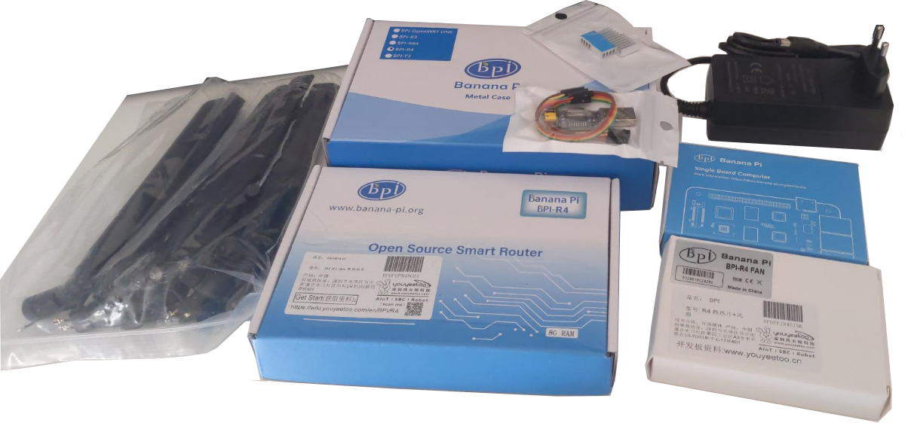

---
date:
  created: 2025-05-31
  updated: 2025-08-10
authors:
- nicof2000
categories:
- NixOS
- Networking
readtime: 10
---

# NixOS Router: Banana PI R4

Der [Banana Pi R4](https://wiki.banana-pi.org/Banana_Pi_BPI-R4) ist ein leistungsfähiges und
dabei preislich sehr attraktives Netzwerkgerät, das speziell für anspruchsvolle Anwendungen
entwickelt wurde. Ausgestattet mit dem MediaTek MT7988 SoC und bis zu 8 GB DDR4-RAM bietet
er eine starke Grundlage für moderne Netzwerkinfrastrukturen. Besonders hervorzuheben sind
die beiden integrierten SFP+ Schnittstellen, die High-Speed-Datenübertragungen mit bis zu
10 Gbit/s ermöglichen. Durch die Unterstützung von Wi-Fi 6, einem M.2-Steckplatz für NVMe-
oder 5G-Module sowie vielseitigen GPIO-Pins ist der BPI-R4 äußerst flexibel und erweiterbar.

<!-- more -->

## Verwendung als All-In-One Netzwerkgerät

<!--
- ifstate (Interface Configuration)
- Firewall/IDS/IPS: nftables (L4 Firewall) / ?? (L7 Firewall) / Suricata (IDS/IPS)
- Knot Resolver/DNS als Recursive/Authorative DNS Server
- Kea DHCP Server für DHCPv4 sowie DHCPv6-PD / radvd für SLAAC
- FRR für dynamisches Routing
- NAT64 Gateway
- Monitoring: SNMPd/LLDP/Prometheus Exporter
- Telefonanlage: Asterisk
- Zigbee2MQTT Gateway
- Radius für 802.1X (LAN) ?
- hostapd für Wireless AP ?
-->

Der Banana Pi R4 soll in meinem Heimnetz nicht nur die klassische Rolle eines Routers
übernehmen, sondern sich als vielseitige All-in-One-Netzwerklösung beweisen. Neben
grundlegenden Aufgaben wie Routing und Firewalling plane ich den Einsatz als NAT64-Gateway,
um IPv6-only Clients den Zugriff auf IPv4-Dienste zu ermöglichen. Auch als Firewall mit
Deep Packet Inspection und einem Intrusion Detection/Prevention System wird das Gerät zum
zentralen Sicherheitsbaustein.

Für maximale Flexibilität bei der Konfiguration der Netzwerkschnittstellen setze ich auf
ifstate, ein deklaratives Werkzeug zur Netzwerkkonfiguration. Die dynamische Routing-Komponente
übernimmt FRR, während nftables als leistungsstarke Firewall-Engine fungiert. Zusätzlich
experimentiere ich mit verschiedenen Layer-7-Firewalls und Suricata als IDS/IPS.

Auch Dienste wie Knot Resolver/DNS (als rekursiver/autoritativer DNS-Server), Kea für DHCPv4
und DHCPv6-PD, sowie radvd für SLAAC kommen zum Einsatz. Optional plane ich, Asterisk als
VoIP-Telefonanlage zu betreiben, um eine vollständige IP-PBX bereitzustellen.

Abgerundet wird das ganze durch LLDP zur Nachbarschaftserkennung sowie diverse Prometheus
Metrics Exporters für Monitoring-Zwecke. Ziel ist es, eine robuste, sichere und flexible
Plattform zu schaffen, die alle zentralen Netzaufgaben in einem kompakten Gerät bündelt
– und das auf Basis von NixOS, um alles deklarativ und reproduzierbar zu halten.

## Verwandte Arbeiten

Für das Vorgängermodell, den Banana Pi R3, gibt es bereits eine größtenteils funktionale
NixOS-Implementierungen. Siehe [Router 2023: Part 1](https://github.com/ghostbuster91/blogposts/blob/main/router2023/main.md), [Router 2023: Part 2](https://github.com/ghostbuster91/blogposts/blob/main/router2023-part2/main.md), [Beispielkonfiguration](https://github.com/nakato/nixos-bpir3-example).

Mitte 2024 entwickelte sich aus dieser Beispielkonfiguration [NixOS SBC](https://github.com/nakato/nixos-sbc)
- ein Modul explizit für Einplatinencomputer, welches auch die Unterstützung des BPI-R4 anstrebt.

Unabhängig davon Dokumentierten die Nutzer newAM und K900 ihre eigenen Fortschritte in
separaten Git Repositores. Siehe: [github:newAM/nixos-bpi-r4](https://github.com/newAM/nixos-bpi-r4), [gitlab:k900/nix](https://gitlab.com/K900/nix/-/blob/master/shared/platform/bpi-r4.nix)

## Beschaffung und Zusammenbau

Die Suche nach einem Anbieter, der die 8-GB-Variante des Banana Pi R4 inklusive Zubehör nach
Deutschland liefert, erwies sich als herausfordernd. Letztendlich habe ich mich für folgenden
Artikel entschieden: [amazon.de/dp/B0F2HZSH3L](https://www.amazon.de/dp/B0F2HZSH3L).
Abweichend zur Produktbeschreibung und den Abbildungen wurde anstatt eines US-Netzteils ein
EU-Netzteil mitgeliefert.



Der Zusammenbau gestaltet sich dank der ausführlichen Anleitung unter
[docs.banana-pi.org/en/BPI-R4/BPI-R4_Accessory_installation](https://docs.banana-pi.org/en/BPI-R4/BPI-R4_Accessory_installation)
äußerst einfach und problemlos.

## Initialer Start mit vorinstalliertem OpeNWRT

Zwei [DIP-Schalter](https://de.wikipedia.org/wiki/DIP-Schalter) erlauben die Auswahl des
Bootmediums. Zunächst stellte ich diese auf die Position 01, um vom NAND-Chip zu booten.
Auf meinem Board war dort OpenWRT in der Version 21.02 installiert. Der Bootlog kann auf
<https://felbinger.eu/attachments/bpi-r4-openwrt21-bootlog.txt> betrachtet werden.

## NixOS SBC
### Bootstrap Image
Im Anschluss nutzte ich die folgenden Befehle, um das Bootstrap-Image von NixOS SBC auf
die SD-Karte zu schreiben:
```sh
nix build github:nakato/nixos-sbc#sdImages.x86_64-linux.sdImage-bananapi-bpir4
zstd -d --stdout result/sd-image/nixos-sd-BananaPi-BPiR4-v0.3.raw.zst | sudo dd of=/dev/sdb bs=4M status=progress
```
Nach dem Umstellen der DIP-Schalter auf Position 11 startete das Gerät NixOS erfolgreich
von der SD-Karte.

Bereits aus den Logs (<https://felbinger.eu/attachments/bpi-r4-nixos-sbc-bootlog.txt>) kann
entnommen werden, dass anders als beim OpenWRT Image lediglich 4 GB RAM erkannt werden. Nach
dem Login mit den Initial-Zugangsdaten (Benutzername: `root`, Passwort: `SBCDefaultBootstrapPassword`)
bestätigte sich dies, sowie die Tatsache, dass das WLAN Modul noch nicht erkannt wurde.
<!-- TODO lässt sich aus Boot-Logs nicht entnehmen, da zu diesem Zeitpunkt WLAN Modul noch nicht eingebaut war -->

### Modifikationen
Der nächste Schritt war es, NixOS SBC so anzupassen, dass eine Veränderungen möglich waren.

#### Initialkonfiguration
Dazu wurde das Repository geklont und zunächst um eine Initialkonfiguration ähnlich der
Konfiguration des Bootstrap Images zu erweitern. Dazu wurde die Flake wie folgt erweitert:
```diff
--- a/flake.nix
+++ b/flake.nix
@@ -59,6 +59,13 @@
                   sbc.bootstrap.initialBootstrapImage = true;
                   sbc.version = "0.3";
                   nixpkgs.hostPlatform.system = system;
+
+                  nix.settings.experimental-features = ["nix-command" "flakes"];
+                  services.openssh = {
+                    enable = true;
+                    settings.PermitRootLogin = "yes";
+                  };
+                  users.users.root.password = lib.mkForce "root";
                 }
               ]
               ++ (lib.optionals (device ? extraModules) device.extraModules)
```

Anschließend wurde eine neue SD Karte mit dem Image geflashed:
```sh
nix build .#sdImages.x86_64-linux.sdImage-bananapi-bpir4
zstd -d --stdout result/sd-image/nixos-sd-BananaPi-BPiR4-v0.3.raw.zst | sudo dd of=/dev/sdb bs=4M status=progress
```

Nachdem das System von dieser gestartet wurde, war feststellbar, dass das Passwort auf root gesetzt war und der SSH Login mit dem root-Nutzer möglich war.

#### 8 GB RAM
Wie bereits beschrieben, konnte mithilfe des NixOS SBC Bootstrap-Image festgestellt werden, dass lediglich 4 GB Arbeitsspeicher erkannt wurde.

In einem Beitrag im Banana Pi Forum fand ich heraus, dass für die Nutzung von 8 GB RAM zwei Bedingungen erfüllt sein mussten. Zum einen muss die DRAM-Konfiguration (dram_configs.mk) eine AVAIL_DRAM_SIZE von 4096 haben, sodass die Einzelmodule korrekt erkannt werden. Außerdem muss, während des Kompilierens der ATF DDR4_4BG_MODE=1 gesetzt werden.

Innerhalb von NixOS SBC wird github:mtk-openwrt/arm-trusted-firmware in einer Version vom März 2025 eingesetzt. Betrachtet man die seit dem durchgeführten Änderungen, so ist erkennbar, dass [Anfang Juli 2025 eine DRAM Konfiguration implementiert wurde](https://github.com/mtk-openwrt/arm-trusted-firmware/blob/mtksoc/plat/mediatek/mt7988/drivers/dram/dram-configs.mk#L12-L20).

Somit ist ein Update dieses Repositories in NixOS SBC nötig. Zusammengefasst ließ sich die Unterstützung der 8 GB RAM durch folgenden Patch implementieren:
```diff
--- a/pkgs/bananaPiR4/default.nix
+++ b/pkgs/bananaPiR4/default.nix
@@ -52,7 +52,7 @@

   armTrustedFirmwareMT7988 =
     (buildArmTrustedFirmware rec {
-      extraMakeFlags = ["USE_MKIMAGE=1" "DRAM_USE_COMB=1" "BOOT_DEVICE=sdmmc" "bl2" "bl31"];
+      extraMakeFlags = ["USE_MKIMAGE=1" "DRAM_USE_COMB=1" "DDR4_4BG_MODE=1" "BOOT_DEVICE=sdmmc" "bl2" "bl31"];
       platform = "mt7988";
       extraMeta.platforms = ["aarch64-linux"];
       filesToInstall = ["build/${platform}/release/bl2.img" "build/${platform}/release/bl31.bin"];
@@ -61,9 +61,9 @@
       src = fetchFromGitHub {
         owner = "mtk-openwrt";
         repo = "arm-trusted-firmware";
-        # mtksoc HEAD 2025-03-12
-        rev = "e090770684e775711a624e68e0b28112227a4c38";
-        hash = "sha256-VI5OB2nWdXUjkSuUXl/0yQN+/aJp9Jkt+hy7DlL+PMg=";
+        # mtksoc HEAD 2025-07-11
+        rev = "78a0dfd927bb00ce973a1f8eb4079df0f755887a";
+        hash = "sha256-m9ApkBVf0I11rNg68vxofGRJ+BcnlM6C+Zrn8TfMvbY=";
       };
       version = "2.12.0-mtk";
       nativeBuildInputs = oldAttrs.nativeBuildInputs ++ [dtc ubootTools which python3];
```


<!--
#### Linux Kernel: 6.12 -> 6.16
tbd
<!-- k900 nutzt 6.16 mit weiteren modifikationen und eigenem u-boot - ->
Vielleicht will man das aber auch gar nicht, weil LTS kernel?
-->

#### Wireguard
Erst während des Einrichtungsprozesses stellte sich heraus, dass keine Wireguard-Interfaces erzeugt
werden konnten, da das entsprechende Kernel-Modul nicht gefunden wurde. Dieses Problem lässt sich
jedoch beheben, indem man die `structuredExtraConfig` anpasst und Wireguard als Kernelmodul hinzufügt:
```diff
--- a/pkgs/bananaPiR4/default.nix
+++ b/pkgs/bananaPiR4/default.nix
@@ -253,6 +253,30 @@

       XFRM_USER = module;
       NFT_XFRM = module;
+
+      ## WireGuard support ##
+      WIREGUARD = module;
+      WIREGUARD_DEBUG = no;
+
+      # Network dependencies
+      NET = yes;
+      INET = yes;
+      NET_UDP_TUNNEL = module;
+      NET_FOU = module;
+
+      # Crypto dependencies
+      CRYPTO = yes;
+      CRYPTO_BLKCIPHER = yes;
+      CRYPTO_BLAKE2S = module;
+      CRYPTO_CHACHA20 = module;
+      CRYPTO_CHACHA20_NEON = module;
+      CRYPTO_CURVE25519 = module;
+      CRYPTO_CURVE25519_NEON = module;
+      CRYPTO_CHACHA20POLY1305 = module;
+      CRYPTO_LIB_CHACHA20 = module;
+      CRYPTO_LIB_POLY1305 = module;
+      CRYPTO_LIB_CURVE25519 = module;
+      CRYPTO_LIB_CHACHA20POLY1305 = module;
     };

     argsOverride = {
```

#### WiFi Modul
tbd
<!-- https://github.com/nakato/nixos-sbc/pull/30 -->

### Nutzung
Nachdem die vorerst notwendigen Modifikationen am System durchgeführt werden,
kann dieses genutzt werden. Dafür werden die oben beschrieben Komponenten in
NixOS deklarativ konfiguriert.

#### Initial Testphase
**Planung**:
Für den ersten Testeinsatz des Systems wird ein einfaches Client-Netzwerk ohne
komplexe Anforderungen angenommen. Dies ermöglicht eine grundlegende Überprüfung
der Funktionalität und Leistungsfähigkeit des Systems.

**Netzwerkdiagramm**:


**Konfiguration**:
Im ersten Schritt wird lediglich eine Basiskonfiguration bestehend aus der
ifstate-Schnittstellenkonfiguration, dem Knot Resolver als Recursive DNS Server,
einem Kea DHCPv4 Server für das Client-Segment und einer einfachen Firewall mit
NAT Funktionalitätdurchgeführt.

<details>
<summary>Konfiguration des Switching Chips in ifstate 2.0.0</summary>

```nix
{
  networking.ifstate.settings.interfaces = {
    "br-lan" = {
      addresses = [ "192.168.178.1/24" ];
      link = {
        kind = "bridge";
        state = "up";
      };
    };
    lan1 = {
      link = {
        state = "up";
        kind = "dsa";
        link = "end0";
        master = "br-lan";
      };
    };
    lan2 = {
      link = {
        state = "up";
        kind = "dsa";
        link = "end0";
        master = "br-lan";
      };
    };
    lan3 = {
      link = {
        state = "up";
        kind = "dsa";
        link = "end0";
        master = "br-lan";
      };
    };
  };
}
```
</details>

**Testen**:
Neben der IPv4 Adressvergabe mittels DHCP, dem DNS Recursor und der NAT wurde primär die Distributed
Switch Architecture (DSA), also die korrekte Funktionalität des eingebauten Switching Chips getestet
wurde. Hierfür kam das Tool iperf zum Einsatz, bei dem 10 GBit Netzwerktraffic zwischen Notebook und
Computer mit einer Geschwindigkeit von 1 Gbit/s ohne wesentliche Belastung der CPU des Routers
übertragen wurden. Das Ergebnis zeigte, dass der Switching-Chip wie erwartet funktioniert.

---

Fortsetzung folgt...
