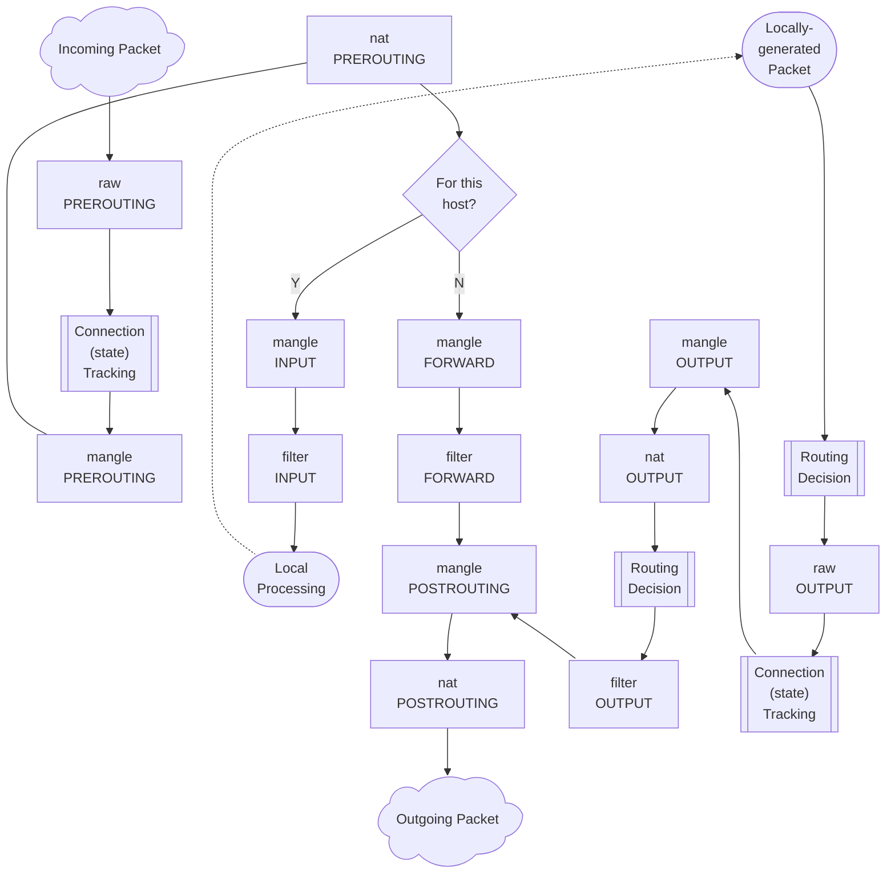
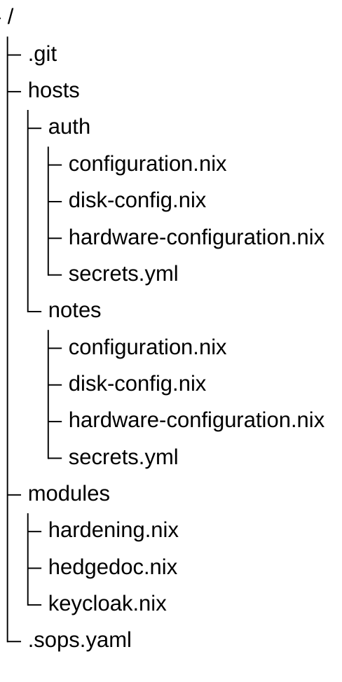
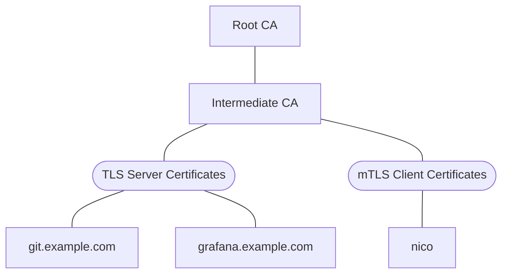

---
date:
  created: 2026-09-27
authors:
- nicof2000
categories:
- NixOS
draft: True
---

# Server- und Netzwerkinfrastruktur mit NixOS (1/2)
<!-- REVIEWERS: Julian K, Jan G, Felix E, Christina K. (mit install) -->

Seit 2019 beschäftige ich mich mit der Administration Linux-basierter Serversysteme. Angefangen
hat alles mit eigenen Projekten. Mit der Zeit übernahm ich jedoch auch die Betreuung von Systemen
für Freunde und Bekannte, darunter beispielsweise für den YouTuber The Morpheus Tutorials.

Um das Einarbeiten weiterer Teammitglieder und die spätere Übergabe von Aufgaben zu vereinfachen,
begann ich Ende 2020 mit der Erstellung des sogenannten [AdminGuide](https://github.com/felbinger/AdminGuide)'s.
Dabei handelte es sich um eine Sammlung aus Konzepten, Beispielkonfigurationen und "Lessons Learned",
die ich bei der Administration der betreuten Systeme angewandt und dokumentiert hatte.

Mit der Zeit stellte ich fest, dass ich bestimmte Komponenten (z. B. Monitoring oder Log-Collection)
in verschiedenen Infrastrukturen mehrfach aufbaute. Um diese Aufgaben zu vereinheitlichen und
wiederverwendbar zu machen, begann ich daher mit der Erstellung eigener Ansible-Rollen.

Ende 2022 beschäftigte ich mich intensiver mit [NixOS](https://nixos.org/) und entschied mich,
einige Komponenten testweise damit neu zu deployen. Von diesem Konzept war ich direkt angetan.
Innerhalb kurzer Zeit migrierte ich schließlich eine vollständig von mir betreute Infrastruktur
auf NixOS.

Im Gegensatz zu traditionellen Automatisierungswerkzeugen wie [Ansible](https://docs.ansible.com/)
oder [Salt](https://saltproject.io/), die überwiegend imperativ arbeiten, setzt NixOS auf eine
deklarative Konfiguration. Dabei wird nicht Schritt für Schritt beschrieben, welche Änderungen
auf einem System vorgenommen werden sollen, sondern welcher Zielzustand erreicht werden soll.
Mit einem sogenannten rebuild wird diese Konfiguration anschließend angewandt und das System
in den definierten Zustand versetzt.

<!-- more -->

Für Server- und Netzwerkinfrastruktur eignet sich NixOS durch die Möglichkeit, die gesamte
Konfiguration versioniert und nachvollziehbar zu verwalten. Die Konfigurationsdateien können
in Git abgelegt werden, was die Zusammenarbeit stark vereinfacht. Änderungen lassen sich
dadurch dokumentieren und vor der Anwendung beispielsweise über Pull Requests prüfen und
reviewen. Gleichzeitig können mehrere Systeme konsistent konfiguriert werden, wodurch
Konfigurationsabweichungen und manuelle Fehler reduziert werden.

Ein weiterer Vorteil ist die Reproduzierbarkeit. Systeme können auf Grundlage derselben
Konfiguration für verschiedene Anwendungsfälle (z. B. Test-, Staging- und Produktionsumgebungen)
aufgebaut werden. Das vereinfacht Wartung, Migration und Wiederherstellung. Durch die Verwaltung
verschiedener Systemgenerationen ist es außerdem möglich, bei fehlerhaften Änderungen auf
eine zuvor funktionierende Konfiguration zurückzurollen.

Für größere Infrastrukturen ist es besonders vorteilhaft, Konfigurationen zentral zu definieren
und von den einzelnen Systemen darauf verweisen zu lassen.
Dadurch entsteht eine zentrale Single Source of Truth.

NixOS bringt jedoch eine deutlich steilere Lernkurve mit sich, da sich sowohl die Nix-Sprache als
auch das deklarative Modell grundlegend von der klassischen Administration anderer
Linux-Distributionen unterscheiden.

## Nix
### Syntax
In diesem Kapitel werden einige Eigenschaften der Nix Syntax erläutert. Es dient primär als Nachschlagewerk für die später genutzten Konfigurationen.
```nix
# Einzeiliger Kommentar

/*
  Mehrzeiliger Kommentar
*/

{
  # Datentypen
  enable = false;
  port = 8000;
  domain = "hedgedoc" + " concat";
  message = ''
    Dieser Text kann
    über mehrere Zeilen gehen.
  '';

  # String-Interpolation
  fqdn = "${hostname}.example.com";
  ignore = ''
    keine ''${String-Interpolation}
    in dieser Variable.
  '';

  # Listen
  webPorts = [ 80 443 ]; # kein Komma!
  sshPorts = [ 22 ];
  allPorts = webPorts ++ sshPorts;

  # Attrs
  server = {
    hostname = "server01";
    role = "webserver";
    sshPort = 22;
  };
  client = {
    name = "nico";
  };
  both = server // client;
}
```

```nix
{
  a.b.c = true;
  # ist das gleiche wie
  a = {
    b = {
      c = true;
    };
  };

  # wenn punkte in key vorkommen, dann muss gequoted werden:
  a."b.c" = true;
  # ist das gleiche wie
  a = {
    "b.c" = true;
  };
}
```

### Package und Option Search
Bei der Konfiguration eines NixOS-Systems ist es häufig notwendig, zunächst den
korrekten Namen eines Pakets oder einer Konfigurationsoption zu ermitteln. Dafür
stellt das Nix-Ökosystem eine [Websuche](https://search.nixos.org) zur Verfügung.

### Formatting
Ein einheitlicher Stil macht Nix-Code leichter lesbar und einfacher zu warten. Dafür
eignen sich zwei Werkzeuge, die unterschiedliche Aufgaben übernehmen: `nixfmt` formatiert
den Code; `deadnix` sucht nach ungenutzten Bindings, also etwa Variablen oder
Funktionsargumenten, die im Ausdruck nicht verwendet werden. 

## Installation
Für die ersten Schritte mit NixOS auf einem Server empfiehlt sich die Installation über
das offizielle Minimal-ISO-Image, das auf der [NixOS-Website](https://nixos.org/download/)
heruntergeladen werden kann.

### Partitionierung
Nachdem NixOS gestartet wurde, muss die Festplatte, auf der es installiert werden soll,
partitioniert werden. [github:nix-community/disko](https://github.com/nix-community/disko)
ermöglicht die Konfiguration von Partitionierung und Formatierung deklarativ in Nix.
Diverse Konfigurationsbeispiele, wie die Verwendung von LUKS oder ZFS, können den
[examples im disko Repository](https://github.com/nix-community/disko/tree/master/example)
entnommen werden.

Um die ersten Schritte übersichtlich zu halten, werden zunächst lediglich eine
EFI-Systempartition sowie ein unverschlüsseltes ext4-root-Dateisystem eingerichtet. In
späteren Kapiteln werden neben der Verwendung von LUKS, LVM und ZFS auch verschiedene
Möglichkeiten zum Entsperren verschlüsselter Systeme behandelt, darunter die TPM-Integration
mittels systemd-cryptenroll sowie das Remote-Entsperren per SSH aus der Initrd-Umgebung.

```nix
# /tmp/disk-config.nix
{
  disko.devices.disk.disk1 = {
    device = "/dev/sda";
    type = "disk";
    content = {
      type = "gpt";
      partitions = {
        esp = {
          name = "boot";
          size = "511M";
          type = "EF00"; # EFI system partition
          content = {
            type = "filesystem";
            format = "vfat";
            mountpoint = "/boot";
          };
        };
        root = {
          name = "root";
          size = "100%";
          content = {
            type = "filesystem";
            format = "ext4";
            mountpoint = "/";
          };
        };
      };
    };
  };
}
```
Die Konfiguration kann mit folgendem Befehl angewandt werden:
```sh
sudo nix --experimental-features "nix-command flakes" run \
  github:nix-community/disko/latest \
  -- --mode destroy,format,mount /tmp/disk-config.nix
```

Alternativ besteht natürlich die Möglichkeit das System manuell zu partitionieren:
```shell
sudo parted /dev/sda -- mklabel gpt
sudo parted /dev/sda -- mkpart ESP fat32 2MB 512MB
sudo parted /dev/sda -- set 1 esp on
sudo parted /dev/sda -- mkpart primary 512MB 100%
sudo mkfs.fat -F 32 -n boot /dev/sda1
sudo mkfs.ext4 /dev/sda2

sudo mount /dev/sda2 /mnt
sudo mkdir /mnt/boot
sudo mount /dev/sda1 /mnt/boot
```

### Minimalinstallation
Anschließend werden mit folgendem Befehl zwei Konfigurationsdateien generiert,
welche im weiteren Verlauf genutzt werden:
```sh
sudo nixos-generate-config --root /mnt
```
Die generierten Konfigurationen liegen unter /mnt/etc/nixos/.

Falls das System mit Disko aufgesetzt wurde, müssen die `fileSystems` und `swapDevices` Optionen
aus der generierte hardware-configuration.nix entfernt werden. Stattdessen wird die disk-config.nix
hinzugefügt.
```sh
sudo mv /tmp/disk-config.nix /mnt/etc/nixos/disk-config.nix
```
Die in der Initrd verfügbaren Kernelmodule können sich je nach System deutlich unterscheiden.
Daher sollte immer die generierte Konfiguration inspiziert werden.
```nix
# hardware-configuration.nix
{ lib, modulesPath, ... }:
{
  imports = [
    (modulesPath + "/profiles/qemu-guest.nix")
  ];

  boot.initrd.availableKernelModules = [
    "ata_piix"
    "uhci_hcd"
    "virtio_pci"
    "virtio_scsi"
    "sd_mod"
    "sr_mod"
  ];

  nixpkgs.hostPlatform = lib.mkDefault "x86_64-linux";
}
```

Die Erzeugte configuration.nix enthält beispielsweise die Konfiguration des Bootloaders,
welche dafür sorgt, dass das System nach der Installation gestartet werden kann. Des Weiteren
wird `system.stateVersion` konfiguriert, welches die nixpkgs Version mit der das System
installiert wurde enthält, um das Verhalten bestimmter systembezogener Dienste und
Standardwerte bei späteren Aktualisierungen kompatibel zu halten.

Sie lässt sich im groben und ganzen auf den folgenden Inhalt reduzieren:
```nix
# configuration.nix
{
  boot.loader = {
    systemd-boot.enable = true;
    efi.canTouchEfiVariables = true;
  };

  console.keyMap = "de";

  services.openssh = {
    enable = true;
    settings.PermitRootLogin = "yes";
  };

  system.stateVersion = "26.05";
}
```

Für die Verwaltung des Systems nutzen wir die modernen Nix Flakes, anstelle von Nix Channels,
daher erstellen wir die Datei flake.nix, in der ein System unter dem Namen `server` erstellt
wird und die generierten Konfigurationsdateien sowie die disk-config.nix geladen werden.
```nix
# flake.nix
{
  inputs = {
    nixpkgs.url = "github:nixos/nixpkgs/nixos-unstable";
    disko.url = "github:nix-community/disko";
  };
  outputs = { nixpkgs, disko, ... }: {
    nixosConfigurations = {
      server = nixpkgs.lib.nixosSystem {
        modules = [
          ./configuration.nix
          ./hardware-configuration.nix
          disko.nixosModules.disko
          ./disk-config.nix
        ];
      };
    };
  };
}
```

Zuletzt kann das System installiert werden:
```sh
sudo nixos-install --root /mnt/ --flake /mnt/etc/nixos/#server
```

Dabei wird die `flake.lock` erzeugt, welche die konkreten Versionen beinhaltet,
die verwendet werden. Die `flake.lock` kann durch den Befehl `nix flake update`
auf die jeweils aktuellsten Versionen aktiviert werden.

Schlussendlich wird das System mit dem Befehl `reboot` neugestartet.

## Netzwerkimplementierung
NixOS bietet verschiedene Möglichkeiten das Netzwerk zu konfigurieren:

1. die klassischen `networking.*`-Optionen
2. `NetworkManager`
3. `systemd-networkd`
4. `ifstate`

Die Wahl der Netzwerkimplementierung hängt letztlich von den individuellen Anforderungen und
Präferenzen ab. Obwohl in der NixOS-Netzwerk-Community von den klassischen `networking.*`-Optionen
abgeraten wird, stellt sie für den Einstieg dennoch eine praktikable Lösung dar.

Für eine konsistente Systemlandschaft kann es jedoch sinnvoll sein, auf allen Systemen dieselbe
Implementierung einzusetzen. Dadurch bleibt die Konfiguration einheitlich und leichter
nachvollziehbar. Aufgrund der hohen Flexibilität von IfState und der Fokus dieses Artikels auf
Server- und Netzwerkinfrasturkur (also Router) wird daher IfState verwendet.

Folgender Codeblock enthält eine statische Dual-Stack (IPv4 + IPv6) Konfiguration.
Die MAC- sowie IP-Adresse und Routen müssen entsprechend angepasst werden.

```nix
# networking.nix
{
  networking = {
    ifstate = {
      enable = true;
      settings = {
        interfaces.ens18 = {
          addresses = [
            "192.168.0.100/24"  # TODO
            "fd08:ef47:ab81:f69d:1034:56ff:fe78:9abc/64"  # TODO
          ];
          link = {
            state = "up";
            kind = "physical";
          };
          identify.perm_address = "12:34:56:78:9a:bc"; # TODO
        };
        routing.routes = [
          {
            to = "0.0.0.0/0";
            dev = "ens18";
            via = "192.168.0.1";  # TODO
          }
          {
            to = "::/0";
            dev = "ens18";
            via = "fe80::1";  # TODO
          }
        ];
      };
    };
    nameservers = [ "1.1.1.1" ];
  };
}
```

Anschließend wird die networking.nix in der flake.nix eingebunden:
```nix
# flake.nix
{
  inputs = {
    nixpkgs.url = "github:nixos/nixpkgs/nixos-unstable";
    disko.url = "github:nix-community/disko";
  };
  outputs = { nixpkgs, disko, ... }: {
    nixosConfigurations = {
      server = nixpkgs.lib.nixosSystem {
        modules = [
          ./configuration.nix
          ./hardware-configuration.nix
          disko.nixosModules.disko
          ./disk-config.nix
          ./networking.nix  # <----
        ];
      };
    };
  };
}
```

Schlussendlich wird das System mit dem Befehl `sudo nixos-rebuild switch --flake /etc/nixos#server`
neu gebaut, wodurch die Konfiguration angewandt wird.

## Dienste betreiben
Nachdem NixOS installiert und die grundlegende Systemkonfiguration eingerichtet ist, widmen
wir uns nun dem eigentlichen Zweck des Servers: der Bereitstellung von Diensten.
Als ersten Dienst betreiben wir HedgeDoc, eine webbasierte Anwendung zur gemeinsamen
Bearbeitung von Markdown-Dokumenten.

Dabei erweitern wir die Konfiguration schrittweise: von einer minimalen Einrichtung bis hin
zu einer öffentlich erreichbaren Instanz. Nach jedem Schritt aktivieren wir die Konfiguration
und überprüfen, welche Änderungen NixOS tatsächlich vorgenommen hat.

!!! info "Strukturierung"
    Die in den folgenden Kapiteln dargestellten Codeblöcke enthalten zur
    besseren Nachvollziehbarkeit sämtliche angepassten Dienstkonfigurationen.
    Grundsätzlich empfiehlt es sich, für jeden Dienst eine separate Datei
    anzulegen, um die Konfiguration übersichtlich zu halten.

    Mehr Informationen können dem Kapitel [Strukturierung der NixOS Konfiguration](
      #strukturierung-der-nixos-konfiguration) entnommen werden.

### Minimalkonfiguration

Das NixOS-Modul für HedgeDoc lässt sich zunächst mit nur einer Option aktivieren.
Grundsätzlich ist es egal, in welcher Datei die Konfiguration definiert wird,
solange diese im System (in der flake.nix) importiert wird. Im Folgenden wird
die Konfiguration in der bislang leeren Datei `hedgedoc.nix` vorgenommen.
```nix
{
  services.hedgedoc.enable = true;
}
```
Nachdem die Änderungen mit `sudo nixos-rebuild switch --flake /etc/nixos#server`
übernommen wurden, ist feststellbar, dass der systemd-Service `hedgedoc` läuft und
HedgeDoc auf der IPv6-Loopback-Adresse ([::1]) auf Port 3000 zur Verfügung steht
(siehe `systemctl status hedgedoc` sowie `ss -tlpn`).

### HedgeDoc direkt erreichbar machen

Eine Möglichkeit um den Zugriff von anderen Computern auf HedgeDoc zu ermöglichen,
wäre die Anpassung der "Listen Address" auf allen Netzwerkadressen:
```nix
{
  services.hedgedoc = {
    enable = true;
    settings.host = "0.0.0.0";
  };
}
```
Die Adresse 0.0.0.0 steht dabei für alle IPv4-Netzwerkinterfaces des Servers. Nach
einem erneuten Deployment ist HedgeDoc beispielsweise über die URL
`http://192.168.0.100:3000` erreichbar.

Für einen produktiven Betrieb ist diese Variante allerdings nicht ideal. Der interne
Webserver der Anwendung wird dadurch direkt dem Netzwerk beziehungsweise dem Internet
ausgesetzt. Außerdem müsste sich die Anwendung selbst um Themen wie TLS-Terminierung
(hier: https), HTTP-Weiterleitungen und gegebenenfalls weitere
Sicherheits- und Proxy-Einstellungen kümmern.

Stattdessen setzen wir einen Reverse Proxy vor HedgeDoc. Der Reverse Proxy nimmt die
externen Verbindungen entgegen und leitet sie intern an HedgeDoc weiter. Dadurch kann
der eigentliche Dienst weiterhin nur auf einer lokalen Adresse lauschen. Nginx übernimmt
später unter anderem die Entgegennahme der HTTP-Verbindungen und die TLS-Terminierung.
Bei HedgeDoc müssen außerdem WebSocket-Verbindungen korrekt weitergereicht werden, da
sie beispielsweise für die Echtzeitkommunikation verwendet werden.

### nginx als Reverse Proxy konfigurieren

Damit der Reverse Proxy sinnvoll konfiguriert werden kann, benötigen wir zunächst
einen DNS-Namen. In diesem Beispiel verwenden wir `notes.example.com`

Das HedgeDoc-Modul kann die passende nginx-Konfiguration automatisch erzeugen:
```nix
{
  services.hedgedoc = {
    enable = true;
    configureNginx = true;
    settings.domain = "notes.example.com";
  };
}
```
Mit `configureNginx = true` wird nginx als Abhängigkeit aktiviert und ein virtueller
Host für die angegebene Domain angelegt. Beim Aktivieren der Konfiguration erhalten
wir jedoch eine Fehlermeldung, die uns darüber Informiert, dass kein TLS Zertifikat
für diesen vHost verfügbar ist. Dies hängt damit zusammen, dass das hedgedoc
NixOS-Modul die Option forceSSL im nginx vHost auf true setzt, welche dann ein für
diese Domain gültiges TLS Zertifkat erfordert. Zunächst deaktivieren wir dieses
verhalten des Moduls, um den Dienst über nginx mittels http bereitzustellen.

```nix
{
  services = {
    hedgedoc = {
      enable = true;
      configureNginx = true;
      settings.domain = "notes.example.com";
    };
    nginx.virtualHosts."notes.example.com".forceSSL = false;
  };
}
```

Auch dies führt zu einer Fehlermeldung, da die Option bereits definiert ist.
Die Lösung für dieses Problem wird im nächsten Kapitel erläutert.

### NixOS config merge

An dieser Stelle kommt eine wichtige Eigenschaft von NixOS zum Einsatz:
Mehrere Konfigurationsfragmente können dieselbe Option setzen. NixOS muss
deshalb entscheiden, welcher Wert verwendet wird. Dafür gibt es nummerische
Prioritäten. Der normale Standardwert einer Option wird mit der Priorität 100
behandelt. Mit lib.mkOverride können wir einen Wert mit einer anderen Priorität
definieren. Eine niedrigere Zahl hat dabei eine höhere Priorität.
```nix
{ lib, ... }:
{
  services = {
    hedgedoc = {
      enable = true;
      configureNginx = true;
      settings.domain = "notes.example.com";
    };
    nginx.virtualHosts."notes.example.com".forceSSL = lib.mkOverride 99 false;
  };
}
```
Nachdem dieser Konfiguration übernommen wurde, ist feststellbar dass nginx
HedgeDoc zwar auf Port 80 zur Verfügung stellt, es von außen aber dennoch
nicht erreichbar ist. Dies hängt mit der fehlenden Firewall für Port 80 zusammen,
welche durch folgenden Codeblock entsprechend angepasst wird.
```nix
{ lib, ... }:
{
  services = {
    hedgedoc = {
      enable = true;
      configureNginx = true;
      settings.domain = "notes.example.com";
    };
    nginx.virtualHosts."notes.example.com".forceSSL = lib.mkOverride 99 false;
  };
  networking.firewall.allowedTCPPorts = [ 80 ];
}
```
Die Kommunikation zwischen nginx und hedgedoc läuft nun nicht mehr über
TCP/IP ports die lokal gebindet sind, sondern über [unix sockets](https://openbook.rheinwerk-verlag.de/linux_unix_programmierung/Kap11-017.htm).
Dies ist im HedgeDoc Modul von NixOS festgelegt und wird als Best Practice
angesehen.

### TLS
HedgeDoc ist nun über nginx von anderen Computern aus erreichbar. Die Verbindung
verwendet allerdings das unverschlüsseltes HTTP Protokoll. Für den produktiven
Betrieb sollten wir TLS aktivieren, damit Anmeldedaten, Dokumentinhalte und
Sitzungen nicht unverschlüsselt übertragen werden.

Für Zertifikate gibt es verschiedene Möglichkeiten. Für die interne Nutzung
in einer Umgebung wie beispielsweise einem Unternehmen kann man eine eigene PKI
Infrasturktur aufbauen und eigene Zertifikate erstellen. Auf allen Systemen
welche den Dienst nutzen sollen, muss dann ein root CA hinterlegt werden, durch
welches die Gültigkeit des Zertifikats geprüft werden kann. Mehr dazu im Kapitel
[Fortgeschrittene Konzepte -> PKI](#pki).

Alternativ können Zertifikate über externe Zertifizierungsstellen wie DigiCert,
GlobalSign oder GoDaddy bezogen werden. Unternehmen nutzen diese Anbieter häufig,
um von zusätzlichen Garantieleistungen, erweiterten Validierungsstufen (OV/EV)
oder umfassenden Supportangeboten zu profitieren.

Einige Organisationen bieten kostenlose TLS-Zertifikate an. Der bekannteste Anbieter
ist Let’s Encrypt, eine von der gemeinnützigen Internet Security Research Group (ISRG)
betriebene Zertifizierungsstelle. Das Projekt wurde 2015 gestartet und stellt kostenlose
und automatisiert ausgestellte TLS-Zertifikate bereit, um verschlüsselte Verbindungen per
HTTPS zu fördern und deren Nutzung als Standard im Internet voranzutreiben.

Neben Let’s Encrypt bieten auch Anbieter wie ZeroSSL und Actalis kostenlose Zertifizierungsdienste
an. Sie unterstützen das ACME-Protokoll (Automatic Certificate Management Environment),
mit dem sich Zertifikate automatisiert ausstellen und verlängern lassen.

Diese kostenlosen Zertifikate sind von den gängigen Browsern als vertrauenswürdig anerkannt
und eignen sich hervorragend für öffentliche Websites, Webanwendungen und APIs. Im Vergleich
zu kommerziellen Angeboten bieten sie zwar keine zusätzlichen Garantieleistungen oder
erweiterte Validierung (z. B. EV-Zertifikate), erfüllen aber auf technischer Ebene die
selben Sicherheitsstandards.

Das ACME-Protokoll definiert verschiedene [Challenges](https://letsencrypt.org/docs/challenge-types/),
die zur Validierung der Domainkontrolle verwendet werden. Diese Validierung ist Voraussetzung für
die Ausstellung eines Zertifikats. Das ACME-Modul von NixOS unterstützt derzeit die Challenges
ACME-HTTP-01 und ACME-DNS-01. Im folgenden Beispiel wird die ACME-HTTP-01-Challenge verwendet.
Dabei wird eine Datei im Verzeichnis `.well-known/acme-challenge/` des Webroots bereitgestellt.
Die Zertifizierungsstelle ruft diese Datei anschließend über HTTP ab. Ist die Datei unter der
erwarteten URL erreichbar, gilt damit als nachgewiesen, dass der Antragsteller die Domain
kontrolliert beziehungsweise den Webserver für diese Domain konfigurieren kann.

Wir entfernen das überschreiben des forceSSL Parameters, ergänzen enableACME auf dem
nginx vHost, akzeptieren die Terms of Service des verwendeten Zertifikatsdienstleisters
und öffnen den für HTTPs verwendeten Port 443 in der Firewall.
```nix
{
  services = {
    hedgedoc = {
      enable = true;
      configureNginx = true;
      settings.domain = "notes.example.com";
    };
    nginx.virtualHosts."notes.example.com".enableACME = true;
  };
  security.acme.acceptTerms = true;
  networking.firewall.allowedTCPPorts = [
    80
    443
  ];
}
```
Aufgrund des standardmäßig vom HedgeDoc Module gesetzten forceSSL Parameters werden
anschließend sämtliche Requests von HTTP auf HTTPS angehoben.

### PostgreSQL
Standardmäßig verwendet HedgeDoc SQLite um Daten persistent zu speichern. Das ist
für eine minimale Installation praktisch, weil keine zusätzliche Datenbank eingerichtet
werden muss. Für einen produktiven Betrieb ist eine separate Datenbank wie PostgreSQL
jedoch die bessere Wahl, da bei mehreren gleichzeitigen Zugriffen und schreibintensiven
Anwendungen eine dateibasierte Datenbank an ihre Grenzen stößt.
```nix
{
  services = {
    postgresql = {
      enable = true;
      ensureDatabases = [ "hedgedoc" ];
      ensureUsers = [
        {
          name = "hedgedoc";
          ensureDBOwnership = true;
        }
      ];
    };
    hedgedoc = {
      enable = true;
      configureNginx = true;
      settings = {
        domain = "notes.example.com";
        db = {
          dialect = "postgresql";
          host = "/run/postgresql";
        };
      };
    };
    nginx.virtualHosts."notes.example.com".enableACME = true;
  };
  security.acme.acceptTerms = true;
  networking.firewall.allowedTCPPorts = [
    80
    443
  ];
}
```
Ähnlich wie zuvor nginx verwendet auch hedgedoc den Unix-Domain-Socket für die
Kommunikation mit der PostgreSQL Datenbank. Die zuvor verwendete SQLite Datenbank
(/var/lib/hedgedoc/db.sqlite) wird nicht mehr benötigt und kann nun gelöscht werden.

### Web Application Firewall
Eine Web Application Firewall (WAF) schützt Webanwendungen auf HTTP-Ebene, indem
sie nicht nur IP-Adressen und Ports, sondern auch die Inhalte von HTTP-Anfragen
analysiert. Dadurch kann sie verdächtige Muster erkennen und beispielsweise SQL-,
SSTI- und Command-Injection-Versuche sowie Cross-Site-Scripting blockieren.

Im folgenden wird [ModSecurity](https://github.com/owasp-modsecurity/ModSecurity) mit
dem OWASP Core Ruleset (CRS) in Nginx integriert. Requests, die einen zuvor
definierten Anomaly Score überschreiten, werden automatisch protokolliert
(`SecRuleEngine DetectionOnly`) oder abgelehnt (`SecRuleEngine On`).
Dadurch lassen sich bestimmte Angriffe auf HedgeDoc oder verwendete Bibliotheken
bereits vor ihrer Verarbeitung durch die Anwendung abfangen.

Für die meisten Anwendungen müssen einzelne Regeln des CRS deaktiviert oder angepasst
werden, da sie andernfalls legitime Anfragen blockieren können. Bei HedgeDoc betrifft
dies beispielsweise die für die kollaborative Bearbeitung erforderliche WebSocket
basierte Kommunikation (`/socket.io/`) sowie die Funktion zum Löschen von Notes
(`/history/`).

Dazu laden wir [github:coreruleset/coreruleset](https://github.com/coreruleset/coreruleset)
in der derzeit aktuellsten Version v4.29.0 in den Nix Store, erstellen die
ModSecurity Konfiguration im Nix Store und passen die Konfiguration von nginx
entsprechend an, sodass Modsecurity als zusätzliches Modul geladen und mit der
zuvor erstellten Konfiguration aktiviert wird:
```nix
{ pkgs, ... }:
{
  services = {
    postgresql = {
      enable = true;
      ensureDatabases = [ "hedgedoc" ];
      ensureUsers = [
        {
          name = "hedgedoc";
          ensureDBOwnership = true;
        }
      ];
    };
    hedgedoc = {
      enable = true;
      configureNginx = true;
      settings = {
        domain = "notes.example.com";
        db = {
          dialect = "postgresql";
          host = "/run/postgresql";
        };
      };
    };
    nginx =
      let
        modsecurity_crs = pkgs.fetchFromGitHub {
          owner = "coreruleset";
          repo = "coreruleset";
          rev = "v4.29.0";
          hash = "sha256-NvBwGFgch+7tnGjcpm47n0mGy0vj5i+JWtb7d033u2s=";
        };
        modsecurity_conf = pkgs.writeText "modsecurity.conf" ''
          SecAuditEngine RelevantOnly
          SecAuditLog /var/log/nginx/modsec.json
          SecAuditLogFormat JSON
          SecAuditLogParts ABIJDEFHZ

          SecRuleEngine On

          SecDefaultAction "phase:1,log,auditlog,pass"
          SecDefaultAction "phase:2,log,auditlog,pass"

          SecRuleRemoveByTag "platform-iis"
          SecRuleRemoveByTag "platform-windows"

          # socket.io endpoint: Request content type is not allowed by policy
          SecRule REQUEST_HEADERS:Host "@streq notes.example.com" \
            "chain, id:10000, phase:1, pass, nolog"
            SecRule REQUEST_URI "@beginsWith /socket.io/" \
              "ctl:ruleRemoveById=920420"

          # Delete note: Method is not allowed by policy
          SecRule REQUEST_HEADERS:Host "@streq notes.example.com" \
            "chain, id:10001, phase:1, pass, nolog"
            SecRule REQUEST_URI "@beginsWith /history/" \
              "ctl:ruleRemoveById=911100"

          SecAction "id:900000,phase:1,pass,t:none,nolog,setvar:tx.blocking_paranoia_level=2"
          SecAction "id:900010,phase:1,pass,t:none,nolog,setvar:tx.enforce_bodyproc_urlencoded=1"
          SecAction "id:900990,phase:1,pass,t:none,nolog,setvar:tx.crs_setup_version=400"

          Include ${modsecurity_crs}/rules/*.conf
        '';
      in
      {
        virtualHosts."notes.example.com".enableACME = true;
        additionalModules = [ pkgs.nginxModules.modsecurity ];
        appendHttpConfig = ''
          modsecurity on;
          modsecurity_rules_file ${modsecurity_conf};
        '';
      };
  };
  security.acme.acceptTerms = true;
  networking.firewall.allowedTCPPorts = [
    80
    443
  ];
}
```


### Secrets Management
Beim Blick in die HedgeDoc-Logs (`systemctl status hedgedoc` bzw.
`journalctl -u hedgedoc`) fällt folgende Meldung auf:

> Session secret not set. Using random generated one.
> Please set `sessionSecret` in your config.json file.
> All users will be logged out.

HedgeDoc verwendet ein Session-Secret, um die Sitzungs-Cookies der Benutzer zu
signieren beziehungsweise zu validieren. Wird bei jedem Start ein neues zufälliges
Secret erzeugt, können bereits vorhandene Cookies nach einem Neustart nicht mehr
überprüft werden. Dadurch werden alle aktiven Benutzer abgemeldet.

Das Session-Secret muss daher dauerhaft gespeichert und bei jedem Start erneut
verwendet werden.

Grundsätzlich ließe sich das Secret direkt über die NixOS-Option
`services.hedgedoc.settings.sessionSecret` setzen. Sensible Werte sollten jedoch
nicht unmittelbar in der Nix-Konfiguration hinterlegt werden, da diese im Nix Store,
welcher von allen Benutzern des Systems gelesen werden kann, gespeichert werden.

Stattdessen speichern wir Secrets in verschlüsselten Dateien außerhalb des Nix Stores.
Für diesen Zweck verwenden wir [sops](https://github.com/getsops/sops) zusammen mit
[sops-nix](https://github.com/mic92/sops-nix). Die Secrets bleiben dabei verschlüsselt
im Repository und werden erst während der Aktivierung der NixOS-Konfiguration auf dem
Zielsystem entschlüsselt. sops-nix legt die einzelnen Werte anschließend als
geschützte Dateien im Dateisystem ab und kann deren Besitzer und Zugriffsrechte deklarativ
festlegen.

Jedoch bietet HedgeDoc nicht die Möglichkeit das Secret direkt aus einer von
sops-nix bereitgestellten Datei einzulesen. Die Anwendung erwartet stattdessen
den entsprechenden Konfigurationswert beziehungsweise die Umgebungsvariable
`CMD_SESSION_SECRET` (HedgeDoc hieß früher CodiMD, daher das `CMD`).

Zunächst wird die flake.nix um sops-nix erweitert:
```nix
# flake.nix
{
  inputs = {
    nixpkgs.url = "github:nixos/nixpkgs/nixos-unstable";
    disko.url = "github:nix-community/disko";
    sops-nix.url = "github:Mic92/sops-nix";  # <--
  };
  outputs = { nixpkgs, disko, sops-nix, ... }: {  # <--
    nixosConfigurations = {
      server = nixpkgs.lib.nixosSystem {
        modules = [
          # ...
          sops-nix.nixosModules.default  # <--
        ];
      };
    };
  };
}
```
Anschließend erzeugen wir die Schlüsselpaare für die Administratoren
sowie die Systeme, die auf diese Zugreifen müssen. Neben
[age Keys](https://github.com/filosottile/age) unterstützt sops auch
GPG Keys. Darüber hinaus können SSH Keys verwendet werden, sofern sie
zuvor mit `ssh-to-age` zu einem age Public Key konvertiert wurden.
Grundsätzlich sollte Schlüsselmaterial nicht mehrfach verwendet werden.
Abhängig von der jeweiligen Systemkonfiguration kann dies in diesem Fall
jedoch vertretbar sein.

Da wir das `age` Paket bisher nicht installiert haben, können wir ein
weiteres Feature von NixOS nutzen: DevShells. Mithilfe von
`nix shell nixpkgs#age --extra-experimental-features "nix-command flakes"`
können wir diese in der aktuellen Shell verfügbar machen. Alternativ
besteht natürlich die Möglichkeit das Paket permanent zu installieren,
da dieses jedoch im weiteren Verlauf nicht nötig ist und grundsätzlich
auf Serversystemen nur notwendige Pakete installiert sein sollten, wird
darauf bewusst verzichtet.

Ein age Keypair mit sicheren Unix Zugriffsrechten kann mithilfe der
folgenden Befehle erstellt werden:
```sh
OLD_UMASK=$(umask)
umask 0177
age-keygen > ~root/private.key
umask ${OLD_UMASK}
```

Danach kann die .sops.yaml angelegt werden, in welcher die Schlüssel
mit den jeweiligen Secret-Dateien verknüpft werden.
```yml
# .sops.yaml
keys:
  - &nico age1x0hr45ueh3nu4xypjltmlssz9jexyalzwu4296600gs9mlpl95rq2ny2es
  - &hedgedoc age12lasmrsaj50hanwq743lljq94x0ax2ht5jf9dysauqt5s22263vs5ql6f0

creation_rules:
  - path_regex: secrets.yaml
    key_groups:
      - age: [ *nico, *hedgedoc ]
```
Nun kann die entsprechende secrets.yaml mit `sops secrets.yaml` angelegt werden.
Wie bereits zuvor ist auch sops derzeit nicht auf dem System hinterlegt. Wieder
kann eine Nix DevShell verwendet werden um den Befehl verfügbar zu machen.
Da dieser Befehl im weiteren Verlauf des Blogartikels häufiger benötigt wird
können wir ihn alternativ permanent verfügbar machen, in dem wir unsere Nix
Konfiguration um `environment.systemPackages = [ pkgs.sops ];` erweitern.
In der Datei secrets.yaml fügen wir folgenden Inhalt mit zufallsgeneriertem Passwort hinzu:
```yml
hedgedoc:
  sessionSecret: My_S3cure-R4nd0m-S3cr3t
```
Abschließend lässt sich die Nix-Konfiguration so anpassen, dass das Secret
geladen und entschlüsselt als Datei bereitgestellt wird. Unterstützt eine
Anwendung das Einlesen von Secrets aus Dateien nicht, können diese mit SOPS
in einem Template formatiert und anschließend beispielsweise als
Umgebungsvariablendatei eingebunden werden.
```nix
{ pkgs, config, ... }:
{
  sops = {
    defaultSopsFile = ./secrets.yaml;
    age = {
      keyFile = "/root/private.key";
      sshKeyPaths = [ ];
    };
    secrets."hedgedoc/sessionSecret" = { };
    templates."hedgedoc/environment".content = ''
      CMD_SESSION_SECRET=${config.sops.placeholder."hedgedoc/sessionSecret"}
    '';
  };

  services = {
    postgresql = {
      enable = true;
      ensureDatabases = [ "hedgedoc" ];
      ensureUsers = [
        {
          name = "hedgedoc";
          ensureDBOwnership = true;
        }
      ];
    };
    hedgedoc = {
      enable = true;
      configureNginx = true;
      settings = {
        domain = "notes.example.com";
        db = {
          dialect = "postgresql";
          host = "/run/postgresql";
        };
      };
      environmentFile = config.sops.templates."hedgedoc/environment".path;
    };
    nginx =
      let
        modsecurity_crs = pkgs.fetchFromGitHub {
          owner = "coreruleset";
          repo = "coreruleset";
          rev = "v4.29.0";
          hash = "sha256-NvBwGFgch+7tnGjcpm47n0mGy0vj5i+JWtb7d033u2s=";
        };
        modsecurity_conf = pkgs.writeText "modsecurity.conf" ''
          SecAuditEngine RelevantOnly
          SecAuditLog /var/log/nginx/modsec.json
          SecAuditLogFormat JSON
          SecAuditLogParts ABIJDEFHZ

          SecRuleEngine On

          SecDefaultAction "phase:1,log,auditlog,pass"
          SecDefaultAction "phase:2,log,auditlog,pass"

          SecRuleRemoveByTag "platform-iis"
          SecRuleRemoveByTag "platform-windows"

          # socket.io endpoint: Request content type is not allowed by policy
          SecRule REQUEST_HEADERS:Host "@streq notes.example.com" \
            "chain, id:10000, phase:1, pass, nolog"
            SecRule REQUEST_URI "@beginsWith /socket.io/" \
              "ctl:ruleRemoveById=920420"

          # Delete note: Method is not allowed by policy
          SecRule REQUEST_HEADERS:Host "@streq notes.example.com" \
            "chain, id:10001, phase:1, pass, nolog"
            SecRule REQUEST_URI "@beginsWith /history/" \
              "ctl:ruleRemoveById=911100"

          SecAction "id:900000,phase:1,pass,t:none,nolog,setvar:tx.blocking_paranoia_level=2"
          SecAction "id:900010,phase:1,pass,t:none,nolog,setvar:tx.enforce_bodyproc_urlencoded=1"
          SecAction "id:900990,phase:1,pass,t:none,nolog,setvar:tx.crs_setup_version=400"

          Include ${modsecurity_crs}/rules/*.conf
        '';
      in
      {
        virtualHosts."notes.example.com".enableACME = true;
        additionalModules = [ pkgs.nginxModules.modsecurity ];
        appendHttpConfig = ''
          modsecurity on;
          modsecurity_rules_file ${modsecurity_conf};
        '';
      };
  };
  security.acme.acceptTerms = true;
  networking.firewall.allowedTCPPorts = [
    80
    443
  ];
}
```
Wird ein Key in der .sops.yaml aktualisiert, muss die secrets.yaml mit
`sops updatekeys secrets.yaml` aktualisiert werden.

Die Verwendung einer Umgebungsvariablen ist zwar sicherer, als das Secret direkt
in der Nix-Konfiguration zu hinterlegen. Sie bringt jedoch einen weiteren Nachteil
mit sich: Umgebungsvariablen sind an den jeweiligen Prozess gebunden und können je
nach Systemkonfiguration über das proc-Dateisystem ausgelesen werden
(`/proc/{pid}/environ`). Ein Prozess mit ausreichenden Berechtigungen (z. B.
ptrace) kann dadurch auf die Umgebungsvariablen anderer Prozesse zugreifen und
somit auch das Session-Secret einsehen.

Das Init-System systemd stellt mit `LoadCredential` zwar einen geeigneteren
Mechanismus bereit. Dabei werden Zugangsdaten beim Start des Dienstes in
einem geschützten, temporären Verzeichnis abgelegt. HedgeDoc unterstützt
jedoch weiterhin nicht das Auslesen von Secrets aus Dateien, weshalb dies
in diesem Fall nicht angewandt werden kann.

<!--
TODO
### Single Sign-On (SSO)
HedgeDoc kann die Authentifizierung an einen externen Identity Provider (IdP)
auslagern. Benutzerkonte und Passwörter müssen dadurch nicht mehr ausschließlich
in HedgeDoc verwaltet werden, sondern können zentral über den IdP gepflegt werden.

Ein weiterer Vorteil ist Single Sign-on (SSO): Nach einer erfolgreichen Anmeldung
am Identity Provider können Benutzer auf alle angebundenen Anwendungen zugreifen,
ohne sich dort erneut anmelden zu müssen. Die Anwendungen leiten den Benutzer zur
Anmeldung an den IdP weiter und erhalten anschließend die für die eigene Sitzung
benötigten Authentifizierungsinformationen.

Im Folgenden konfigurieren wir HedgeDoc so, dass die Authentifizierung über OpenID
Connect (OIDC) und Keycloak erfolgt. Keycloak ist eine Open-Source-Plattform für
Identity- und Access-Management und übernimmt in diesem Aufbau die zentrale Verwaltung
der Benutzer sowie deren Anmeldung.

Während sich einige Anwendungen wie HedgeDoc vollständig über Nix konfigurieren lassen,
gibt es auch Ausnahmen. Keycloak ist ein Beispiel dafür: Zwar kann NixOS Keycloak auf
dem System installieren und als Dienst betreiben, die eigentliche Konfiguration von
Benutzern und OIDC-Clients erfolgt standardmäßig jedoch manuell über die Weboberfläche.

!!! info
    Das NixOS-Modul für Keycloak bietet grundsätzlich die Möglichkeit, Realms
    über eine JSON-Datei zu konfigurieren (`services.keycloak.realmFiles`).
    Dadurch ließe sich auch die Keycloak-Konfiguration deklarativ verwalten.
    Diese Variante behandeln wir hier jedoch nicht, da sie ein detaillierteres
    Verständnis der Keycloak-Datenstruktur und der Realm-Konfiguration voraussetzt.
    Stattdessen nehmen wir die notwendigen Einstellungen zunächst direkt über die
    Weboberfläche vor.

Wird keycloak lediglich mit `services.keycloak.enable = true;` aktiviert, erhalten
wir verschiedene Fehlermeldungen. Anders als HedgeDoc nutzt Keycloak keine SQLite
Datenbank, sondern erfordert von Anfang an die Konfiguration einer PostgreSQL Datenbank.
Des Weiteren muss ein Hostname gesetzt und TLS aktiviert werden.

Für ein einfacheres Verständnis der Zusammenhänge in diesem Blogartikel wird die
ModSecurity Konfiguration um eine Regel erweitert, die die WAF für alle Anfragen an
Keycloak deaktiviert.
```nix
{ pkgs, ... }:
{
  services = {
    postgresql = {
      enable = true;
      ensureDatabases = [
        "hedgedoc"
        "keycloak"
      ];
      ensureUsers = [
        {
          name = "hedgedoc";
          ensureDBOwnership = true;
        }
        {
          name = "keycloak";
          ensureDBOwnership = true;
        }
      ];
    };
    hedgedoc = {
      enable = true;
      configureNginx = true;
      settings = {
        domain = "notes.example.com";
        db = {
          dialect = "postgresql";
          host = "/run/postgresql";
        };
      };
    };
    nginx =
      let
        modsecurity_crs = pkgs.fetchFromGitHub {
          owner = "coreruleset";
          repo = "coreruleset";
          rev = "v4.29.0";
          hash = "sha256-NvBwGFgch+7tnGjcpm47n0mGy0vj5i+JWtb7d033u2s=";
        };
        modsecurity_conf = pkgs.writeText "modsecurity.conf" ''
          SecAuditEngine RelevantOnly
          SecAuditLog /var/log/nginx/modsec.json
          SecAuditLogFormat JSON
          SecAuditLogParts ABIJDEFHZ

          SecRuleEngine On

          SecDefaultAction "phase:1,log,auditlog,pass"
          SecDefaultAction "phase:2,log,auditlog,pass"

          SecRuleRemoveByTag "platform-iis"
          SecRuleRemoveByTag "platform-windows"

          # socket.io endpoint: Request content type is not allowed by policy
          SecRule REQUEST_HEADERS:Host "@streq notes.example.com" \
            "chain, id:10000, phase:1, pass, nolog"
            SecRule REQUEST_URI "@beginsWith /socket.io/" \
              "ctl:ruleRemoveById=920420"

          # Delete note: Method is not allowed by policy
          SecRule REQUEST_HEADERS:Host "@streq notes.example.com" \
            "chain, id:10001, phase:1, pass, nolog"
            SecRule REQUEST_URI "@beginsWith /history/" \
              "ctl:ruleRemoveById=911100"

          # disable for keycloak
          SecRule REQUEST_HEADERS:Host "@streq auth.example.com" \
            "chain, id:10002, pass, nolog, ctl:ruleEngine=off"

          SecAction "id:900000,phase:1,pass,t:none,nolog,setvar:tx.blocking_paranoia_level=2"
          SecAction "id:900010,phase:1,pass,t:none,nolog,setvar:tx.enforce_bodyproc_urlencoded=1"
          SecAction "id:900990,phase:1,pass,t:none,nolog,setvar:tx.crs_setup_version=400"

          Include ${modsecurity_crs}/rules/*.conf
        '';
      in
      {
        virtualHosts."notes.example.com".enableACME = true;
        virtualHosts."auth.example.com" = {
          locations = {
            "= /".return = "307 https://${hostname}/realms/main/account/";
            "/" = {
              proxyPass = "https://127.0.0.1:8443/";
              proxyWebsockets = true;
            };
            "~* (/admin|/realms/master)" = {
              proxyPass = "https://127.0.0.1:8443";
              proxyWebsockets = true;
            };
          };
          enableACME = true;
        };
        additionalModules = [ pkgs.nginxModules.modsecurity ];
        appendHttpConfig = ''
          modsecurity on;
          modsecurity_rules_file ${modsecurity_conf};
        '';
      };
    keycloak = let
      hostname = "auth.example.com";
    in {
      enable = true;
      settings = {
        inherit hostname;
        proxy-headers = "forwarded";
      };
      database.host = "/run/postgresql";
        sslCertificateKey = "/var/lib/acme/${hostname}/key.pem";
        sslCertificate = "/var/lib/acme/${hostname}/fullchain.pem";
    };
  };
  security.acme.acceptTerms = true;
  networking.firewall.allowedTCPPorts = [
    80
    443
  ];
}
```
TODO:
- this chapter has not been reviewed yet
- keycloak isn't working like this, was complicated last time we did it... see helpwave
- show pictures of keycloak setup (webgui)
- adjust hedgedoc in separate codeblock for oidc login
-->

## Systemhärtung
Unter Systemhärtung versteht man alle Maßnahmen, die darauf abzielen,
die Angriffsfläche eines Systems zu reduzieren und dessen Sicherheit zu
erhöhen. Dazu gehören beispielsweise das Deaktivieren nicht benötigter Dienste,
die Einschränkung von Zugriffsrechten, eine gezielte Konfiguration von
Netzwerkfunktionen sowie die Absicherung administrativer Zugänge.

Die folgenden Kapitel beschreiben ausgewählte technische Härtungsmaßnahmen
unter NixOS. Sie sind als Beispiele und Anregungen zu verstehen und stellen
keine allgemeingültige Konfiguration für jedes System dar.

Der wichtigste Hinweis lautet daher: Systemhärtung ist immer systemspezifisch.
Die erforderlichen Einstellungen hängen von der jeweiligen Aufgabe, der
Netzwerkumgebung und dem individuellen Bedrohungsmodell ab. Ein System, das
als Router eingesetzt wird, benötigt beispielsweise IP-Forwarding. Wird diese
Funktion aus Sicherheitsgründen deaktiviert, kann es seine eigentliche Aufgabe
nicht erfüllen. Ein SSH-Jump-Host kann wiederum Agent-Forwarding oder andere
spezielle SSH-Funktionen benötigen, die auf einem gewöhnlichen Server
möglicherweise bewusst abgeschaltet werden sollten.

Eine sinnvolle Härtung besteht deshalb nicht darin, möglichst viele Funktionen
pauschal zu deaktivieren. Entscheidend ist vielmehr, nur die tatsächlich benötigten
Dienste und Berechtigungen zu aktivieren, ihre Verwendung gezielt einzuschränken
und die Konfiguration regelmäßig zu überprüfen. Sicherheit, Funktionalität und
Wartbarkeit müssen dabei stets gemeinsam betrachtet werden.

### Benutzer
Bisher erfolgte der Zugriff auf den Server über den Benutzer root, dessen
Anmeldung per SSH ausdrücklich erlaubt war. Da root über uneingeschränkte
Rechte verfügt, werden alle ausgeführten Befehle unmittelbar mit den höchstmöglichen
Privilegien ausgeführt. Für viele administrative Aufgaben ist das jedoch nicht
erforderlich. Ein Fehler bei der Eingabe oder Ausführung eines Befehls kann dadurch
weitreichende Auswirkungen auf das gesamte System haben. Insbesondere in Umgebungen
mit mehreren Administratoren ist die Verwendung personalisierter Benutzerkonten
empfehlenswert. Dadurch lassen sich Zugriffe und Änderungen besser einer bestimmten
Person zuordnen.

Für jeden Administrator wird zunächst ein eigener Benutzeraccount angelegt,
dass Passwort kann mithilfe von Secrets ebenfalls deklarativ festgelegt werden.
Dieser wird der Gruppe wheel hinzugefügt, wodurch er administrative Befehle
über sudo ausführen kann. Die erhöhten Rechte werden somit nur gezielt und für
einzelne Befehle verwendet. Anschließend wird die direkte Anmeldung von root
über SSH deaktiviert.
```nix
{ config, ... }:
{
  sops.secrets."passwords/nico".neededForUsers = true;

  users.users.nico = {
    isNormalUser = true;
    extraGroups = [ "wheel" ];
    hashedPasswordFile = config.sops.secrets."passwords/nico".path;
  };

  services.openssh.settings.PermitRootLogin = "no";
}
```

#### Mutable Users

Wenn das System ausschließlich von Administratoren genutzt und vollständig
deklarativ über NixOS verwaltet wird, kann es sinnvoll sein, veränderliche
Nutzer zu deaktivieren. Dadurch wird verhindert, dass Benutzer außerhalb der
NixOS-Konfiguration angelegt, geändert oder gelöscht werden. Auch Änderungen
wie Passwortänderungen über klassische Systemwerkzeuge sind anschließend
nicht mehr dauerhaft möglich.
```sh
{
  users.mutableUsers = false;
}
```

#### Password policy

Andernfalls ist eine Passwortrichtlinie empfehlenswert, welche die Verwendung
von triviale oder bereits zuvor verwendete Passwörter verhindert. Die für das
PAM Modul pwquality verwendbaren Parameter können der
[manpage](https://linux.die.net/man/8/pam_pwquality) entnommen werden.
```nix
{ pkgs, config, lib, ... }:
{
  security.pam.services.passwd.rules.password = {
    pwquality = {
      control = "required";
      modulePath = "${pkgs.libpwquality.lib}/lib/security/pam_pwquality.so";
      # order BEFORE pam_unix.so
      order = config.security.pam.services.passwd.rules.password.unix.order - 10;
      settings = {
        minlen = 24;
        dcredit = (-2);  # digits
        lcredit = (-3);  # lowercase
        ucredit = (-3);  # uppercase
        ocredit = (-1);  # other
        maxrepeat = 3;   # amount of consecutive characters
        enforce_for_root = true;
      };
    };
    unix = {
      control = lib.mkForce "required";
      settings.use_authtok = true;
    };
  };
}
```
Negative Werte bei *credit legen eine Mindestanzahl der jeweiligen Zeichenart
fest. Ein positiver Wert würde dagegen lediglich die Anzahl der zulässigen Zeichen
dieser Kategorie beeinflussen und kein Sonderzeichen erzwingen.

#### SSH Keys
Die Authentifizierung über SSH-Schlüssel bietet gegenüber der passwortbasierten
Anmeldung sowohl Sicherheits- als auch Komfortvorteile, da sie das Risiko von
Phishing, Keyloggern und wiederverwendeten Passwörtern reduziert und der private
Schlüssel nach dem einmaligen Entsperren für die Dauer der Sitzung genutzt werden
kann, ohne die Passphrase bei jeder Verbindung erneut eingeben zu müssen.
```nix
{
  services.openssh.settings.PasswordAuthentication = false;
  users.users.nico.openssh.authorizedKeys.keys = [
    "ssh-ed25519 AAAAC3NzaC1lZDI1NTE5AAAAIBhgHhBf2mK4BwbrBsJREYMfQJ2jNfhOtRt61EV/hsxV"
  ];
}
```
Der private Schlüssel sollte ausschließlich auf dem eigenen Endgerät gespeichert
und mit einer Passphrase geschützt werden. Auf dem Server beziehungsweise in der Nix
Konfiguration wird nur der zugehörige öffentliche Schlüssel hinterlegt. Noch besser ist
es, den privaten Schlüssel auf einem dedizierten Hardware-Sicherheitsschlüssel zu speichern,
beispielsweise einem FIDO2- oder OpenPGP-kompatiblen Security Key (z. B. einem YubiKey).
Dadurch verlässt der private Schlüssel das Gerät nicht und kann in der Regel auch
nicht ausgelesen werden. Für die Authentifizierung muss der Sicherheitsschlüssel physisch
angeschlossen und gegebenenfalls durch eine PIN oder eine Berührung bestätigt werden.

#### fail2ban
Ist das System aus nicht vertrauenswürdigen Netzwerken erreichbar (z. B. Internet),
ist der Einsatz von fail2ban empfehlenswert. Der Dienst überwacht fehlgeschlagene
Anmeldeversuche und sperrt IP-Adressen, von denen innerhalb eines bestimmten
Zeitraums wiederholt verdächtige Zugriffe ausgehen.
```nix
{
  services.fail2ban = {
    enable = true;
    maxretry = 5;
    bantime = "8h";
  };
}
```

### SSH
Neben den im vorherigen Kapitel beschriebenen Einstellungen bietet SSH zahlreiche
weitere Konfigurationsoptionen, die abhängig vom Einsatzzweck des Systems geprüft
und angepasst werden sollten. Auf den meisten Anwendungsservern wird beispielsweise
kein TCP/SSH Forwarding benötigen und können somit
deaktiviert werden:
```nix
{
  services.openssh.settings = {
    AllowTcpForwarding = false;
    AllowAgentForwarding = false;
  };
}
```

### Nix
Der Nix-Daemon unseres Systems erlaubt standardmäßig die Interaktion mit allen
Benutzern. Dadurch können diese beispielsweise dynamisch Software mit nix shell
oder nix run nachladen und ausführen. Auf einem Server ist dieses Verhalten in
der Regel nicht erforderlich und kann einem Angreifer zusätzliche Möglichkeiten
bieten, eigene Software auf das System zu bringen. Daher empfiehlt es sich, den
Zugriff auf den Nix-Daemon auf administrative Benutzer zu beschränken.
```nix
{
  nix.settings.allowed-users = [ "@wheel" ];
}
```

### procfs
Im Secrets Management Kapitel wurde erläutert, dass Benutzer mit bestimmten Rechten,
beispielsweise ptrace, auf die Umgebungsvariablen anderer Prozessen zugreifen können.
Mit der procfs Mount-Option `hidepid=2` lässt sich der Zugriff auf Prozessinformationen
für andere Benutzer einschränken.
```nix
{
  fileSystems."/proc" = {
    fsType = "proc";
    device = "proc";
    options = [
      "nosuid"
      "nodev"
      "noexec"
      "hidepid=2"
    ];
    neededForBoot = true;
  };
}
```

### usbguard
Auf dedizierter Server-Hardware werden USB-Geräte häufig nur für Wartungsarbeiten
verwendet. Tastatur, Installationsmedium oder externe Datenträger sind im laufenden
Betrieb normalerweise nicht erforderlich. USBGuard kann deshalb dazu verwendet werden,
nicht freigegebene USB-Geräte abzulehnen.

Das reduziert beispielsweise das Risiko, dass ein sogenanntes BadUSB Gerät als
Tastatur oder Netzwerkadapter auftritt.
```nix
{
  services.usbguard = {
    enable = true;
    IPCAllowedGroups = [ "wheel" ];
    presentControllerPolicy = "apply-policy";
    rules = ''
      # internals
      allow id 1d6b:0002 serial "0000:00:1a.0" name "EHCI Host Controller" hash "ej1WVedyLyUMLiQxzEcrwbY45zCodwV85Kzy7hm2Gv4=" parent-hash "e/RW0mMbM+TSFQxpRiMEfL7/3RJfKVdqffBm9F5qA+E=" with-interface 09:00:00
      allow id 1d6b:0001 serial "0000:01:00.4" name "UHCI Host Controller" hash "ne9MN86uM98TZw0LqhyL7OKEHJUygyWvOjNn1b7Bz+E=" parent-hash "EcoU0c5jMQvq9JSIgu5Ho4RdsdfPb6n13C6Y3wIzu8A=" with-interface 09:00:00
      allow id 1d6b:0002 serial "0000:00:14.0" name "xHCI Host Controller" hash "4G5jM1710eMHdxBgzKu2iYUFH6ol62c9Vx62XFHYQFM=" parent-hash "ej1WVedyLyUMLiQxzEcrwbY45zCodwV85Kzy7hm2Gv4=" with-interface 09:00:00
      allow id 1d6b:0003 serial "0000:00:14.0" name "xHCI Host Controller" hash "MMn/OTrO6E00ngK2hDw0p2Q5Qi8H5me5tOmYALU4gm8=" parent-hash "ej1WVedyLyUMLiQxzEcrwbY45zCodwV85Kzy7hm2Gv4=" with-interface 09:00:00
      allow id 8087:800a serial "" name "" hash "oHMq3XbdbTUsMz5PFkIzzYMCE7ad0v00udn0iZ88B2Q=" parent-hash "ej1WVedyLyUMLiQxzEcrwbY45zCodwV85Kzy7hm2Gv4=" via-port "1-1" with-interface 09:00:00
      allow id 8087:8002 serial "" name "" hash "qIGkfqX7sv9oTIomveqlZ93sazJ7vBpO2+lAls7F8UQ=" parent-hash "ej1WVedyLyUMLiQxzEcrwbY45zCodwV85Kzy7hm2Gv4=" via-port "2-1" with-interface 09:00:00

      # peripheral
      allow id 046a:c122 serial "" name "CHERRY USB Keyboard" hash "KDR4ikabgRgNdISC+g/6BjObDBJi8I8UuyiBNOevd3A=" with-interface { 03:01:01 03:00:00 }
    '';
  };
}
```

### Firewall
Wie bei der Netzwerkkonfiguration unterstützt NixOS verschiedene Firewall-Implementierungen,
darunter iptables, nftables und firewalld. In diesem Kapitel verwenden wir nftables, da es
die umfangreiche Modulauswahl von iptables mit einer übersichtlicheren und besser lesbaren
Regelsyntax verbindet.

Das integrierte NixOS-Firewall-Modul eignet sich vor allem für einfache Regeln zu eingehenden
Verbindungen. In unserer Infrastruktur benötigen wir jedoch zusätzlich Regeln für ausgehenden
Datenverkehr. Später kommen auf dem Router außerdem Weiterleitungen und NAT-Regeln hinzu. Da
das NixOS-Modul dafür nicht genügend Flexibilität bietet, definieren wir die Firewall-Regeln
vollständig manuell mit nftables.

```nix
{
  networking.nftables = {
    enable = true;
    tables.nixos-fw = {
      enable = true;
      name = "nixos-fw";
      family = "inet";
      content = ''
        chain input-allow {
          icmp type echo-request accept
          icmpv6 type {
            echo-request, echo-reply,
            nd-neighbor-solicit, nd-neighbor-advert,
            nd-router-solicit, nd-router-advert,
            parameter-problem, destination-unreachable, packet-too-big, time-exceeded
          } accept

          # SSH, HTTP und HTTPS (udp für HTTP/3 (QUIC))
          tcp dport ssh accept
          tcp dport http accept
          meta l4proto { tcp, udp } th dport https accept
        }

        chain output-allow {
          icmp type echo-request accept
          icmpv6 type {
            echo-request, echo-reply,
            nd-neighbor-solicit, nd-neighbor-advert,
            nd-router-solicit, nd-router-advert,
            parameter-problem, destination-unreachable, packet-too-big, time-exceeded
          } accept

          # DNS, NTP, HTTP und HTTPS (udp für HTTP/3 (QUIC))
          udp dport domain accept
          udp dport ntp accept
          tcp dport http accept
          meta l4proto { tcp, udp } th dport https accept
        }

        chain input {
          type filter hook input priority filter; policy drop;

          iifname "lo" accept comment "trusted interfaces"

          ct state vmap {
            established : accept,
            related : accept,
            invalid : drop,
            new : jump input-allow,
            untracked : jump input-allow
          }
        }

        chain output {
          type filter hook output priority filter; policy drop

          oifname lo accept comment "trusted interfaces"

          ct state vmap {
            established : accept,
            related : accept,
            invalid : drop,
            new : jump output-allow,
            untracked : jump output-allow
          }

          reject
        }

        chain forward {
          type filter hook forward priority filter; policy drop;
        }
      '';
    };
  };
}
```

Das Regelwerk von nftables ist hierarchisch aufgebaut:
Tables enthalten Chains, die wiederum aus Regeln bestehen.

Die input Chain wird über eine type Definition direkt an einen Netfilter-Hook
gebunden. Sie wird dadurch registriert und automatisch für den entsprechenden
Paketpfad ausgewertet. Die Chain input-allow wird dagegen lediglich aus der
registrierten input-Chain über einen jump aufgerufen und dient lediglich dazu,
die Regeln für erlaubte eingehende Verbindungen strukturiert abzulegen.

Für das Verständnis von nftables ist der Paketpfad durch den Linux-Netzwerk-Stack
entscheidend. Abhängig von Herkunft und Ziel durchläuft jedes Paket bestimmte
Netfilter-Hooks:

- Pakete, die über ein Netzwerkinterface eintreffen, passieren zunächst den Hook prerouting.
- Anschließend entscheidet der Kernel anhand der Routing-Tabelle, ob das Paket für einen lokalen Prozess bestimmt ist oder weitergeleitet werden soll.
- Lokale Pakete durchlaufen den Hook input.
- Weiterzuleitende Pakete werden am Hook forward verarbeitet.
- Pakete, die von lokalen Prozessen erzeugt werden, beginnen am Hook output.
- Bevor ein Paket das System über ein Netzwerkinterface verlässt, wird es am Hook postrouting verarbeitet.

Folgendes Diagramm visualisiert diesen Flow:

<!--  -->
<!-- AI generated: -->


### Kernel
Der Linux-Kernel bildet die zentrale Grundlage des Systems und verfügt über weitreichende
Zugriffsrechte. Eine gezielte Härtung reduziert daher die verfügbare Angriffsfläche,
schränkt den Zugriff auf sensible Kernel- und Prozessinformationen ein und verhindert
das Nachladen nicht benötigter Kernelkomponenten.
```nix
{
  boot = {
    kernelParams = [ "debugfs=off" ];
    kernel.sysctl."kernel.yama.ptrace_scope" = 2;
  };
  security = {
    lockKernelModules = true;
    pam.loginLimits = [
      {
        domain = "*";
        item = "core";
        type = "hard";
        value = "0";
      }
      {
        domain = "*";
        item = "core";
        type = "soft";
        value = "0";
      }
    ];
  };
}
```
Durch die Anpassung der Kernel-Bootparameter wurde debugfs deaktiviert. Dieses
Dateisystem dient primär als Diagnose- und Entwicklungswerkzeug und wird auf
Produktionsservern normalerweise nicht benötigt. Seine Deaktivierung verhindert,
dass darüber umfangreiche Informationen über den Kernelzustand und laufende
Systemkomponenten ausgelesen werden können.

Zusätzlich wurde der Laufzeitparameter `kernel.yama.ptrace_scope` so konfiguriert,
dass die Verwendung von ptrace nur mit der Capability `CAP_SYS_PTRACE` möglich ist.
ptrace ermöglicht es einem Prozess, andere Prozesse zu untersuchen und teilweise
deren Speicher zu verändern. Die Einschränkung reduziert daher das Risiko, dass ein
kompromittierter Prozess auf sensible Daten oder den Speicher anderer Prozesse zugreift.

Das Deaktivieren des automatischen Nachladens von Kernelmodulen reduziert sowohl
die Angriffsfläche als auch das Risiko einer kernelbasierten Persistenz. Ein Angreifer
kann dadurch nicht ohne Weiteres ein zusätzliches oder manipuliertes Kernelmodul
aktivieren, um eine Schwachstelle auszunutzen oder ein Rootkit dauerhaft im System
zu verankern, das bei späteren Systemstarts automatisch geladen wird.

Abschließend wurde die Erstellung von Core Dumps deaktiviert. Dabei handelt es sich um
Speicherabbilder abgestürzter Prozesse, die zwar bei der Fehlersuche hilfreich sein können,
unter Umständen jedoch Passwörter, kryptografische Schlüssel oder andere vertrauliche
Laufzeitdaten enthalten. Auf Produktionsservern ist es daher sinnvoll, Core Dumps zu
deaktivieren.

## Strukturierung der NixOS Konfiguration
Eine Infrastruktur besteht selten nur aus einem einzigen System.
Sobald mehrere Systeme verwaltet werden müssen, stellt sich die
Frage, wie die NixOS-Konfiguration sinnvoll organisiert werden
kann. NixOS eignet sich besonders gut dafür, als Infrastruktur
as Code (IaC) in einem Git-Repository abgelegt zu werden. Die
Konfiguration aller Systeme kann dadurch versioniert, nachvollziehbar
geändert und reproduzierbar ausgerollt werden. Eine einfache und
gut erweiterbare Struktur besteht aus einem Verzeichnis für die
einzelnen Hosts und einem zweiten Verzeichnis für wiederverwendbare
Module.

Das folgende Beispiel beschreibt eine mögliche Struktur:

<!--
TODO: Inline Descriptions und Logos funktionieren nicht, siehe:
https://mermaid.ai/open-source/syntax/treeView.html#inline-descriptions-with

-->

## Monitoring
Mit zunehmender Anzahl an Servern gewinnt auch das Monitoring
an Bedeutung. Es liefert einen Überblick über den Zustand und
die Verfügbarkeit der Systeme und hilft dabei, Probleme frühzeitig
zu erkennen. Dabei können beispielsweise die CPU- und RAM-Auslastung,
der verfügbare Speicherplatz, die Erreichbarkeit von Diensten sowie
die Gültigkeit von TLS-Zertifikaten überwacht werden.

Für die Umsetzung eines Monitorings existieren verschiedene Ansätze.
Beim Push-Modell senden überwachte Systeme ihre Metriken aktiv an eine
zentrale Monitoring-Instanz. Beim Pull-Modell werden die Metriken
hingegen von der Monitoring-Instanz regelmäßig bei den überwachten
Systemen abgefragt. Entsprechend vielfältig ist auch die Auswahl
an verfügbaren Werkzeugen.

In diesem Kapitel wird die Implementierung eines Pull-basierten
Monitorings mit Prometheus beschrieben. Wie bereits bei der
Systemhärtung dienen die folgenden Beispiele lediglich als Anregung
und stellen keine vollständige Monitoring-Konfiguration dar. Welche
Metriken erfasst und welche Benachrichtigungen eingerichtet werden,
hängt stark von der jeweiligen Umgebung und den individuellen Anforderungen
ab. Besonders bei der Definition von Alerts gibt es zahlreiche Möglichkeiten
von einfachen Schwellwerten bis hin zu komplexen, aus mehreren Metriken
abgeleiteten Regeln.

```nix
{
  services.prometheus = {
    enable = true;
    scrapeConfigs = [
      {
        job_name = "prometheus";
        static_configs = [ { targets = [ "localhost:9090" ]; } ];
      }
    ];
  };
}
```

### Exporter
Auf der Prometheus-Website findet sich eine umfangreiche Übersicht
verschiedener Exporter, die auf Systemen installiert werden können,
um Metriken für Prometheus bereitzustellen:
<https://prometheus.io/docs/instrumenting/exporters/>.

Besonders hervorzuheben sind der offizielle node_exporter und der
blackbox_exporter.

node_exporter stellt Hardware- und Betriebssystemmetriken bereit. Dazu gehören
beispielsweise Informationen zur CPU- und Speicherauslastung, zu Dateisystemen,
Netzwerkverbindungen und Systemlast.
```nix
{
  services.prometheus.exporters.node = {
    enable = true;
    enabledCollectors = [ "systemd" ];
  };
}
```
Auf dem Monitoring System wird dann die entsprechende Scrape Config hinzugefügt:
```nix
{
  services.prometheus.scrapeConfigs = [
    {
      job_name = "node-exporter";
      static_configs = [
        {
          targets = [
            "notes.example.com:9100"
            "auth.example.com:9100"
            "monitoring.example.com:9100"
          ];
        }
      ];
      relabel_configs = [
        {
          source_labels = [ "__address__" ];
          regex = "([^:]+):\\d+";
          target_label = "instance";
        }
      ];
    }
  ];
}
```

Der blackbox_exporter prüft die Erreichbarkeit und das Verhalten externer
Endpunkte, indem er sogenannte Blackbox-Probes durchführt. Unterstützt
werden unter anderem Prüfungen über HTTP, HTTPS, DNS, TCP, ICMP und gRPC.
Dadurch lässt sich beispielsweise feststellen, ob ein Webserver erreichbar
ist, ein DNS-Dienst korrekt antwortet oder ein TLS-Zertifikat noch gültig
ist. Da dieser Dienst nicht primär den Zustand des Systems überwacht,
auf dem er ausgeführt wird, wird er auf dem Monitoring-System deployed.
```nix
{
  services.prometheus = {
    exporters.blackbox = {
      enable = true;
      listenAddress = "127.0.0.1";
      configFile = pkgs.writeText "blackbox.yml" ''
        modules:
          http_2xx:
            prober: http
      '';
    };

    scrapeConfigs = [
      {
        job_name = "blackbox-exporter";
        static_configs = [ { targets = [ "127.0.0.1:9115" ]; } ];
      }
      {
        job_name = "blackbox-exporter_http";
        metrics_path = "/probe";
        params.module = [ "http_2xx" ];
        static_configs = [
          {
            targets = [
              "notes.example.com"
              "auth.example.com"
            ];
          }
        ];
        relabel_configs = [
          {
            source_labels = [ "__address__" ];
            target_label = "__param_target";
          }
          {
            source_labels = [ "__param_target" ];
            target_label = "instance";
          }
          {
            target_label = "__address__";
            replacement = "127.0.0.1:9115";
          }
        ];
      }
    ];
  };
}
```

### Alertmanager
Prometheus kann auf Grundlage der gesammelten Metriken Alert-Regeln
auswerten. Für die weitere Verarbeitung und Zustellung der ausgelösten
Alarme ist Alertmanager zuständig. Im folgenden wird eine Regel
implementiert, die einen Alarm auslöst, wenn ein Dateisystem bereits
weniger als zehn Prozent freien Speicherplatz besitzt und bei
gleichbleibender Schreibrate voraussichtlich innerhalb der nächsten 24
Stunden vollständig belegt sein wird.
```nix
{
  services.prometheus = {
    rules = [
      (
        builtins.toJSON
        {
          groups = [
            {
              name = "custom";
              rules = [
                {
                  alert = "HostDiskWillFillIn24Hours";
                  expr = ''
                    ((node_filesystem_avail_bytes * 100) / node_filesystem_size_bytes < 10 and ON (instance, device, mountpoint) predict_linear(node_filesystem_avail_bytes{fstype!~"tmpfs"}[1h], 24 * 3600) < 0 and ON (instance, device, mountpoint) node_filesystem_readonly == 0) * on(instance) group_left (nodename) node_uname_info{nodename=~".+"}
                  '';
                  for = "20m";
                  labels = {
                    severity = "warning";
                  };
                  annotations = {
                    summary = "Host disk will fill in 24 hours (instance {{ $labels.instance }})";
                    description = "Filesystem is predicted to run out of space within the next 24 hours at current write rate\n  VALUE = {{ $value }}\n  LABELS = {{ $labels }}";
                  };
                }
              ];
            }
          ];
        }
      )
    ];
    alertmanager = {
      enable = true;
      configuration = {
        route = {
          group_wait = "10s";
          group_interval = "30s";
          repeat_interval = "1d";
          receiver = "default";

          routes = [
            {
              receiver = "default";
              match_re = {
                severity = "critical";
              };
              continue = true;
            }
          ];
        };
        receivers = [
          {
            name = "default";
            email_configs = [ "monitoring-alerts@example.com" ];
          }
        ];
      };
    };
  };
}
```

### Grafana
Zur Visualisierung der mit Prometheus gesammelten Metriken kann Grafana
eingesetzt werden. Die Plattform ermöglicht es, Metriken in übersichtlichen
Dashboards darzustellen, Zeitreihen zu analysieren und relevante
Entwicklungen oder Auffälligkeiten schnell zu erkennen.

```nix
{ config, ... }:
{
  sops.secrets."monitoring/grafana/secretKey".owner = "grafana";

  services = {
    grafana = {
      enable = true;
      settings = {
        server = {
          domain = "grafana.example.com";
          root_url = "https://%(domain)s/";
        };
        security.secret_key = "$__file{${config.sops.secrets."monitoring/grafana/secretKey".path}}";
      };
      provision = {
        enable = true;
        datasources.settings.datasources = [
          {
            name = "Prometheus";
            type = "prometheus";
            url = "http://127.0.0.1:9090";
            isDefault = true;
          }
        ];
      };
    };

    nginx = {
      enable = true;
      virtualHosts."grafana.example.com" = {
        locations."/" = {
          proxyPass = "http://127.0.0.1:3000/";
          proxyWebsockets = true;
        };
        enableACME = true;
        forceSSL = true;
      };
    };
  };
}
```

Wie hedgedoc verwendet auch Grafana Standardmäßig eine sqlite Datenbank.
In dieser werden zwar primär Benutzer und Dashboards gespeichert, dennoch
sollte diese gesichert werden
```nix
{
  services = {
    postgresql = {
      enable = true;
      ensureDatabases = [ "grafana" ];
    };
    grafana.database = {
      type = "postgres";
      host = "/run/postgresql";
      user = "grafana";
    };
  };
}
```

<!--
TODO
Des Weiteren kann auch Grafana an die zuvor eingerichtete Keycloak Instanz
angebunden werden.
```nix
{
  services.grafana.settings = {
    "auth.generic_oauth" = {
      enabled = true;
      name = "Keycloak";
      allow_sign_up = true;
      client_id = "grafana";
      client_secret = "$__file{${config.sops.secrets."monitoring/grafana/oidcSecret".path}}";
      scopes = "email profile roles openid";
      email_attribute_path = "email";
      login_attribute_path = "preferred_username";
      name_attribute_path = "full_name";
      auth_url = "https://grafana.example.com/realms/main/protocol/openid-connect/auth";
      token_url = "https://grafana.example.com/realms/main/protocol/openid-connect/token";
      api_url = "https://grafana.example.com/realms/main/protocol/openid-connect/userinfo";
      role_attribute_path = "contains(roles[*], 'admin') && 'Admin' || contains(roles[*], 'editor') && 'Editor' || 'Viewer'";
    };
  };
}
```
-->

In Grafana selbst (Zugangsdaten: admin:admin) können anschließend die
gewünschten Dashboards importiert beziehungsweise erstellt werden. Beispiele für
von mir verwendete Dashboards können <https://github.com/secshellnet/grafana-dashboards>
entnommen werden.

## Fortgeschrittene Konzepte

### Speicherlayout
Im Kapitel [Installation -> Partitionierung](#partitionierung) wurde der
Übersichtlichkeit halber zunächst eine einfache Speicheraufteilung verwendet.
Neben der EFI-Systempartition bestand das Layout lediglich aus einer
unverschlüsselten ext4-Partition für das root-Dateisystem.

Im Folgenden werden verschiedene abweichende Konfigurationen vorgestellt.

#### LUKS encrypted root
Das root Dateisystem sollte verschlüsselt werden. Zum Zeitpunkt der Installation
kann die disk-config.nix entsprechend Angepasst werden. Disko fragt beim
Partitionieren das Passwort für die Erstellung des Cryptsetups ab.
```nix
{
  disko.devices = {
    disk.disk1 = {
      device = "/dev/sda";
      type = "disk";
      content = {
        type = "gpt";
        partitions = {
          esp = {
            name = "boot";
            size = "511M";
            type = "EF00"; # EFI system partition
            content = {
              type = "filesystem";
              format = "vfat";
              mountpoint = "/boot";
            };
          };
          root = {
            name = "root";
            size = "100%";
            content = {
              type = "luks";
              name = "cryptedroot";
              content = {
                type = "filesystem";
                format = "ext4";
                mountpoint = "/";
              };
            };
          };
        };
      };
    };
  };
}
```

Ein Neustart des Servers führt zur Aufforderung das Passwort einzugeben.
Während dies bei Clientsystemen typischerweise kein Problem darstellt, werden
Server häufig auch über das Netzwerk neugestartet, teilweise ist physikalischer
Zugriff auf die Maschinen gar nicht möglich. Um Systeme entfernt neustarten zu
können, kann im initrd ein SSH server gestartet werden, der dann das entschlüsseln
des systems über ssh ermöglicht. Hierbei ist auf die korrekte angabe der für
Netzwerk benötigten kernel module zu achten.
```nix
{
  boot.initrd = {
    systemd = {
      enable = true;
      network.enable = false;
      initrdBin = [
        (pkgs.writeShellScriptBin "systemctl-default" ''
          /bin/systemctl default
        '')
      ];
      users.root.shell = "/bin/systemctl-default";
    };
    kernelModules = [ "virtio_net" ];
    network = {
      enable = true;
      ifstate = {
        enable = true;
        allowIfstateToDrasticlyIncreaseInitrdSize = true;
        inherit (config.networking.ifstate) settings;
      };
      ssh = {
        enable = true;
        hostKeys = [ /etc/ssh/ssh_host_ed25519_key ];
      };
    };
  };

}
```

Alternativ lässt sich bei vorhandenem TPM-Chip der Remote Unlock durch eine
im TPM gespeicherte Entsperrinformation ersetzen. Dazu kann systemd-cryptenroll
verwendet werden. Die Einrichtung erfolgt beispielsweise mit folgendem Befehl:
```sh
systemd-cryptenroll --tpm2-device=auto --tpm2-pcrs=0 /dev/sda2
```

#### LVM
Eine gemeinsam genutzte root-Partition kann zum Ausfall des Systems führen,
wenn beispielsweise zu viele Logdateien geschrieben wurden und dadurch kein
freier Speicherplatz mehr verfügbar ist. In der Folge können Dienste wie
Datenbanken möglicherweise nicht mehr gestartet werden. Aus sicherheitstechnischer
Sicht kann es außerdem sinnvoll sein, zusätzliche logische Volumes anzulegen, um
darauf spezifische Mount-Optionen wie noexec oder nosuid anzuwenden.
```nix
{
  disko.devices = {
    disk.disk1 = {
      device = "/dev/sda";
      type = "disk";
      content = {
        type = "gpt";
        partitions = {
          esp = {
            name = "boot";
            size = "511M";
            type = "EF00"; # EFI system partition
            content = {
              type = "filesystem";
              format = "vfat";
              mountpoint = "/boot";
            };
          };
          luks = {
            size = "100%";
            content = {
              type = "luks";
              name = "crypted";
              settings.allowDiscards = true;
              content = {
                type = "lvm_pv";
                vg = "pool";
              };
            };
          };
        };
      };
    };
    lvm_vg = {
      pool = {
        type = "lvm_vg";
        lvs = {
          root = {
            size = "2G";
            content = {
              type = "filesystem";
              format = "ext4";
              mountpoint = "/var/log";
              mountOptions = [
                "defaults"
                "nosuid"
                "nodev"
                "noexec"
              ];
            };
          };
          root = {
            size = "100%FREE";
            content = {
              type = "filesystem";
              format = "ext4";
              mountpoint = "/";
              mountOptions = [
                "defaults"
              ];
            };
          };
        };
      };
    };
  };
}
```
#### ZFS
ZFS ist ein modernes Dateisystem mit integriertem Volume-Management.
Gegenüber der bisher verwendeten Kombination aus LVM und ext4 bietet
es zusätzliche Funktionen zur Verwaltung und Absicherung von Speicher.

Dazu zählen unter anderem RAID, Prüfsummen zur Erkennung von Datenfehlern,
Snapshots, Replikation, transparente Kompression und native Verschlüsselung.

Nachteile sind insbesondere der höhere RAM-Bedarf und der zusätzliche
Verwaltungsaufwand. ZFS eignet sich daher besonders für dedizierte
Hardware mit ausreichend Arbeitsspeicher und mehreren physischen
Datenträgern. Der Einsatz in einer virtuellen Maschine ist ebenfalls möglich,
setzt jedoch geeignete virtuelle Datenträger, ausreichend zugewiesene
Ressourcen und die Unterstützung durch den Hypervisor voraus.

Die native ZFS-Verschlüsselung schützt keine Metadaten. Je nach
Anwendungsfall kann daher zusätzlich eine Full-Disk-Verschlüsselung mit
LUKS sinnvoll sein. Datenhaltige ZFS-Datasets können dennoch ebenfalls
durch ZFS verschlüsselt werden, um einfache verschlüsselte Backups mittels
zfs send und zfs receive zu ermöglichen.

Folgende Disko Konfiguration zeigt die Partitionierung mit zwei
physikalischen Festplatten, LUKS und ZFS
```nix
{
  disko.devices = {
    disk = {
      disk1 = {
        device = "/dev/sda";
        type = "disk";
        content = {
          type = "gpt";
          partitions = {
            esp = {
              name = "boot";
              size = "511M";
              type = "EF00"; # EFI system partition
              content = {
                type = "filesystem";
                format = "vfat";
                mountpoint = "/boot/efis/ESP1";
              };
            };
            luks = {
              size = "100%";
              content = {
                type = "luks";
                name = "disk1-crypted";
                settings.allowDiscards = true;
                content = {
                  type = "zfs";
                  pool = "rpool";
                };
              };
            };
          };
        };
      };
      disk2 = {
        device = "/dev/sdb";
        type = "disk";
        content = {
          type = "gpt";
          partitions = {
            esp = {
              name = "boot";
              size = "511M";
              type = "EF00"; # EFI system partition
              content = {
                type = "filesystem";
                format = "vfat";
                mountpoint = "/boot/efis/ESP2";
              };
            };
            luks = {
              size = "100%";
              content = {
                type = "luks";
                name = "disk2-crypted";
                settings.allowDiscards = true;
                content = {
                  type = "zfs";
                  pool = "rpool";
                };
              };
            };
          };
        };
      };
    };
    zpool = {
      rpool = {
        mode = {
          topology = {
            type = "topology";
            vdev = [
              {
                mode = "raidz1";
                members = [
                  "/dev/mapper/disk1-crypt"
                  "/dev/mapper/disk2-crypt"
                ];
              }
            ];
          };
        };
        rootFsOptions = {
          mountpoint = "none";
          compression = "zstd";
          acltype = "posixacl";
          xattr = "sa";
          "com.sun:auto-snapshot" = "true";
        };
        options.ashift = "12";
        datasets = {
          "root" = {
            type = "zfs_fs";
            mountpoint = "/";
          };

          "nix" = {
            type = "zfs_fs";
            options.mountpoint = "/nix";
            mountpoint = "/nix";
          };

          "log" = {
            type = "zfs_fs";
            options.mountpoint = "/var/log";
            mountpoint = "/var/log";
          };
        };
      };
    };
  };
}
```

### Weitere Installationsmöglichkeiten
Neben der im Kapitel [Installation](#installation) beschriebenen Nutzung des offiziellen
ISO-Images, lässt sich aufgrund des deklarativen Ansatzes auch ein angepasstes Image
vergleichsweise einfach erstellen. Dabei können individuelle Konfigurationen direkt
integriert werden:
```nix
{
  inputs.nixpkgs.url = "nixpkgs/nixos-unstable";
  outputs =
    { nixpkgs, ... }:
    {
      nixosConfigurations = {
        customIso = nixpkgs.lib.nixosSystem {
          system = "x86_64-linux";
          modules = [
            "${nixpkgs}/nixos/modules/installer/cd-dvd/installation-cd-minimal.nix"
            (
              { lib, pkgs, ... }:
Ausschließlich der Client mit dem DN `CN=nico,O=example,C=DE` wird akzeptiert.
              {
                # enable serial console
                boot.kernelParams = [ "console=ttyS0,115200n8" ];

                users.users.root = {
                  initialHashedPassword = lib.mkForce null;
                  password = "s3cr3tPasSw0rt";

                  openssh.authorizedKeys.keys = [
                    "ssh-ed25519 AAAAC3NzaC1lZDI1NTE5AAAAICjJMDuek9Ug/Eqc1y6Sq65nLhrgLLSgJYTKlUEw6I13"
                  ];
                };

                console.keyMap = "de";
              }
            )
          ];
        };
      };
    };
}
```
```sh
nix build .#nixosConfigurations.customIso.config.system.build.isoImage
```

Des Weiteren existieren Tools wie [github:elitak/nixos-infect](https://github.com/elitak/nixos-infect)
oder [github:nix-community/nixos-anywhere](https://github.com/nix-community/nixos-anywhere)
welche die Installation von NixOS aus nahezu jedem Linux-basierten System ermöglichen.
Hierfür wird eine im Linux Kernel implementierte Funktion (kexec) verwendet, die ein
neues Kernel-Image lädt und in dieses startet. Mithilfe dieser Werkzeuge kann NixOS auch
auf einem Server installiert werden, wenn der Hosting-Anbieter weder ein NixOS-Image
bereitstellt noch die Verwendung eigener ISO-Images erlaubt.

### PKI
Bisher wurden Zertifikate über die ACME-HTTP-01-Challenge von Let’s Encrypt
bezogen. Bei dieser Challenge muss der HTTP-Endpunkt der jeweiligen Domain
öffentlich erreichbar sein, damit Let’s Encrypt die Domainvalidierung
durchführen kann. Für interne Dienste, die beispielsweise durch eine Firewall
vor dem Internet geschützt sind, ist dieses Verfahren daher nicht geeignet.

Eine Alternative stellt die ACME-DNS-01-Challenge dar. Dabei weist der
ACME-Client die Kontrolle über eine Domain nach, indem er über eine
DNS-API einen speziell erzeugten TXT-Record anlegt. Für die Validierung
ist dadurch kein direkter Zugriff auf den eigentlichen Dienst erforderlich.
Auf diese Weise können auch interne Dienste mit öffentlich vertrauenswürdigen
Let’s-Encrypt-Zertifikaten betrieben werden.

Allerdings werden die Namen solcher Zertifikate in Certificate-Transparency-Logs
veröffentlicht. Dadurch können auch interne Hostnamen oder Subdomains nach außen
bekannt werden. Für interne Dienste, die beispielsweise ausschließlich Administratoren
zur Verfügung stehen, kann deshalb der Betrieb einer eigenen Public-Key-Infrastruktur
(PKI) sinnvoller sein.

Bei einer eigenen PKI wird eine interne Root-CA eingerichtet. Ihr Root-Zertifikat
wird auf den Geräten der Administratoren als vertrauenswürdige Zertifizierungsstelle
hinterlegt. Die internen Webserver erhalten anschließend Zertifikate, die von dieser
CA oder einer untergeordneten Intermediate-CA signiert wurden. Browser und andere
Clients können diese Zertifikate validieren, ohne dass sie von einer öffentlich
vertrauenswürdigen CA ausgestellt sein müssen.

Der private Schlüssel der Root-CA muss besonders geschützt werden und sollte
idealerweise offline aufbewahrt werden. Für den laufenden Betrieb empfiehlt sich
eine Intermediate-CA, welcehe für die Ausstellung von Leaf Zertifikaten verwendet
wird.

Darüber hinaus können mit einer eigenen PKI auch Clientzertifikate für Mutual TLS
(mTLS) ausgestellt werden. Während bei gewöhnlichem TLS nur der Server seine Identität
gegenüber dem Client nachweist, authentifizieren sich bei mTLS beide Kommunikationspartner
gegenseitig. Der Server prüft dabei nicht nur, ob das präsentierte Clientzertifikat
von der eigenen CA signiert wurde, sondern kann zusätzlich anhand von Zertifikatsattributen
oder Seriennummern entscheiden, ob der jeweilige Client zugriffsberechtigt ist.

Das ist insbesondere für administrative Schnittstellen und besonders schützenswerte
interne Dienste sinnvoll. Administratoren oder Systeme ohne gültiges Clientzertifikat
können bereits während des TLS-Verbindungsaufbaus abgewiesen werden. Sie erreichen
dadurch weder die Webanwendung noch deren Anmeldeseite. Ein kompromittiertes oder
erratenes Benutzerpasswort reicht dann allein nicht aus, um Zugriff zu erhalten, da
zusätzlich ein gültiger privater Schlüssel zum Clientzertifikat benötigt wird.

Die oben beschriebene Struktur könnte Beispielsweise so aussehen:



Die Konfiguration im nginx könnte dann beispielsweise so aussehen:
```nix
{
  services.nginx = {
    commonHttpConfig = ''
      map "$ssl_client_verify:$ssl_client_s_dn" $reject {
          default 1;
          "SUCCESS:CN=nico,O=example,C=DE" 0;
      }
    '';
    virtualHosts."service.example.com".extraConfig = ''
      ssl_client_certificate ${./root-ca.pem};
      ssl_verify_client on;

      if ($reject) { return 403; }
    '';
  };
}
```
