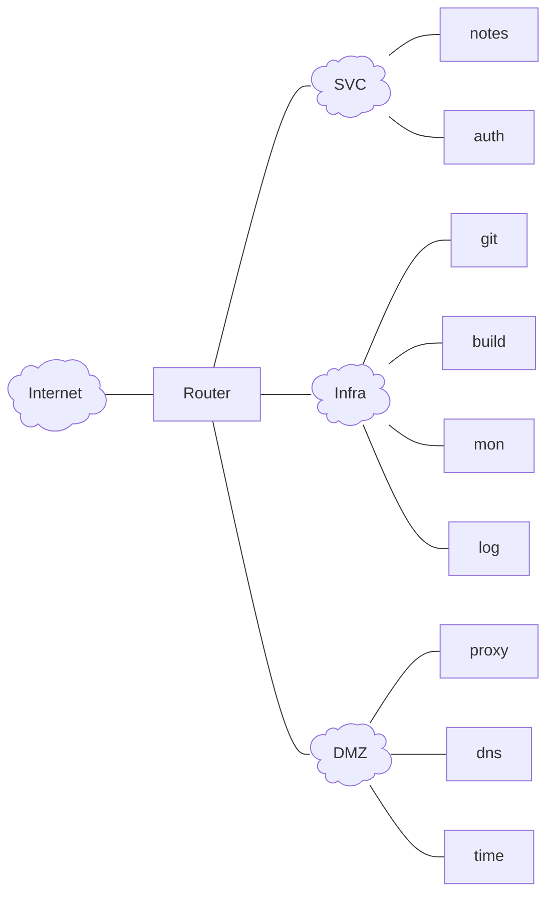
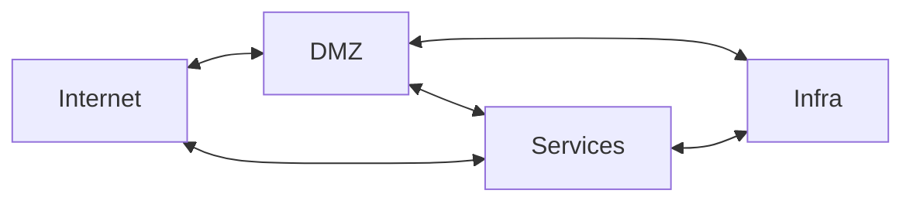

---
date:
  created: 2026-10-14
authors:
- nicof2000
categories:
- NixOS
draft: True
---

# Server- und Netzwerkinfrastruktur mit NixOS (2/2)
Im Rahmen des ersten Artikels wurden eine Einführung in eine Serverkonfiguration mit NixOS gegeben.
Dieser Teil beschäftigt sich mit Strukturierung einer Infrastruktur, komplett basierende auf NixOS.
Der Fokus liegt dabei auf one service per service, security sowie den Aufbau einer ci/cd pipeline
für gitops mit integration des gradient build servers für nix.

<!-- more -->

Die Systeme werden in einem git repository gepflegt und entsprechend der Struktur aus dem vorherigen
Artikel definiert.

Folgendes Netzwerkdiagramm beschreibt den Aufbau schematisch:

In der flake.nix werden nun mehrere Systeme definiert, was eine gemeinsamme
Verwaltung und einheitliche Updatestände ermöglicht.

### Router
Mithilfe von verschiedenen VRF's werden vier Routingdomainen erstellt.
Die jeweils notwendigen Routen werden in die entsprechenden VRF's geleaked.

Infrastruktursysteme sind dazu zur Nutzung der in der DMZ angesiedelten
Dienste (proxy, dns, time) verpflichtet um das Internet zu erreichen.
Auf dem Proxy können für jedes System spezifische Policies implementiert
werden, welche die benötigten Zugriffe erlauben.

Auch Systeme in der Services VRF sollten sofern Möglich die Systeme der
DMZ nutzen. Für nicht HTTP Dienste ist dies jedoch nicht immer möglich. <!-- oder? -->

<!-- vrrp mal testen? -->

### Services
#### notes
hedgedoc
#### auth
keycloak
### Infra
#### git
gitea
#### build
gitea actions, gradient
#### mon
prometheus + grafana
#### log
graylog
### DMZ
#### proxy
squid (forward) + nginx (reverse)
#### dns
knot resolver (kresd)
#### time
chrony
