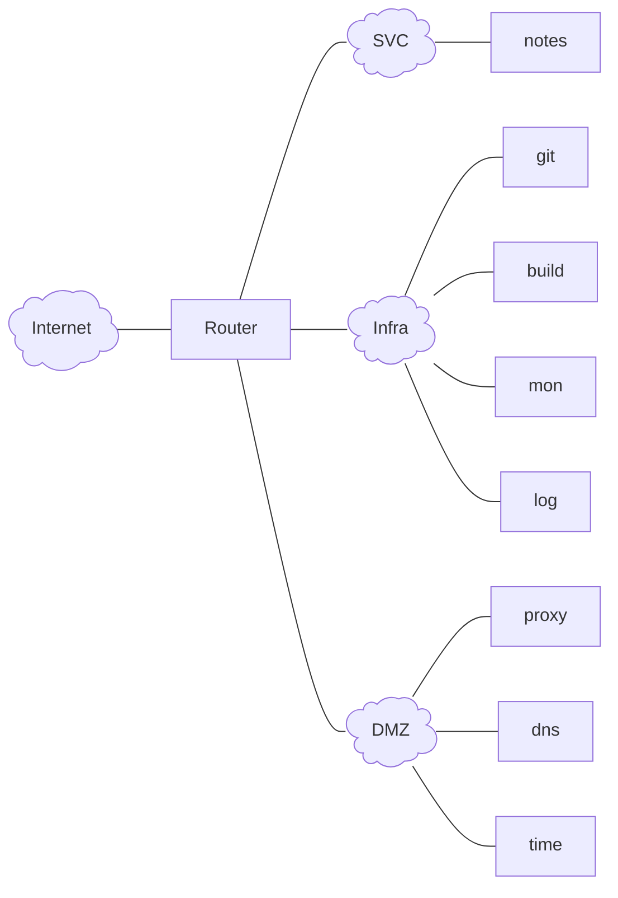

---
date:
  created: 2026-09-16
authors:
- nicof2000
categories:
- NixOS
draft: True
---

# Server- und Netzwerkinfrastruktur mit NixOS
<!-- REVIEWERS: Julian K, Jan G, Felix E -->

<!-- DNS Auf HELPWAVE PVE: hedgedoc.test1234567.de / keycloak.test1234567.de -->

Seit 2019 beschäftige ich mich mit der Administration Linux-basierter Serversysteme. Angefangen
hat alles mit eigenen Projekten. Mit der Zeit übernahm ich jedoch auch die Betreuung von Systemen
für Freunde und Bekannte, darunter beispielsweise für den YouTuber The Morpheus Tutorials.

Um das Einarbeiten weiterer Teammitglieder und die spätere Übergabe von Aufgaben zu vereinfachen,
begann ich Ende 2020 mit der Erstellung des sogenannten [AdminGuide](https://github.com/felbinger/AdminGuide)'s.
Dabei handelte es sich um eine Sammlung aus Konzepten, Beispielkonfigurationen und "Lessons Learned",
die ich bei der Administration der betreuten Systeme angewandt und dokumentiert hatte.

Mit der Zeit stellte ich fest, dass ich bestimmte Komponenten (z. B. Monitoring oder Log-Collection)
in verschiedenen Infrastrukturen mehrfach aufbaute. Um diese Aufgaben zu vereinheitlichen und
wiederverwendbar zu machen, begann ich daher mit der Erstellung eigener Ansible-Rollen.

Ende 2022 beschäftigte ich mich intensiver mit [NixOS](https://nixos.org/) und entschied mich,
einige Komponenten testweise damit neu zu deployen. Von diesem Konzept war ich direkt angetan.
Innerhalb kurzer Zeit migrierte ich schließlich eine vollständig von mir betreute Infrastruktur
auf NixOS.

Im Gegensatz zu traditionellen Automatisierungswerkzeugen wie [Ansible](https://docs.ansible.com/)
oder [Salt](https://saltproject.io/), die überwiegend imperativ arbeiten, setzt NixOS auf eine
deklarative Konfiguration. Dabei wird nicht Schritt für Schritt beschrieben, welche Änderungen
auf einem System vorgenommen werden sollen, sondern welcher Zielzustand erreicht werden soll.
Mit einem sogenannten rebuild wird diese Konfiguration anschließend angewandt und das System
in den definierten Zustand versetzt.

<!-- more -->

Für Server- und Netzwerkinfrastruktur eignet sich NixOS durch die Möglichkeit, die gesamte Konfiguration versioniert und nachvollziehbar
zu verwalten. Die Konfigurationsdateien können in Git abgelegt werden, was die Zusammenarbeit stark vereinfacht. Änderungen lassen sich
dadurch dokumentieren und vor der Anwendung beispielsweise über Pull Requests prüfen und reviewen. Gleichzeitig können mehrere Systeme
konsistent konfiguriert werden, wodurch Konfigurationsabweichungen und manuelle Fehler reduziert werden.

Ein weiterer Vorteil ist die Reproduzierbarkeit. Systeme können auf Grundlage derselben Konfiguration für verschiedene Anwendungsfälle (z. B.
Test-, Staging- und Produktionsumgebungen) aufgebaut werden. Das vereinfacht Wartung, Migration und Wiederherstellung. Durch die Verwaltung
verschiedener Systemgenerationen ist es außerdem möglich, bei fehlerhaften Änderungen auf eine zuvor funktionierende Konfiguration zurückzurollen.

Für Netzwerkinfrastrukturen ist besonders interessant, dass sich Firewall-Regeln, Routing, VLANs, VPNs und Netzwerkdienste zentral definieren
lassen. Dadurch kann die Infrastruktur in weiten Teilen wie Software behandelt werden. Referenzen zwischen den einzelnen Systemen innerhalb der
Codebasis schaffen zudem eine zentrale und konsistente Informationsquelle (Single Source of Truth).

NixOS bringt jedoch eine deutlich höhere Lernkurve mit sich, da sich sowohl die Nix-Sprache als auch das deklarative Modell grundlegend von der
klassischen Administration anderer Linux-Distributionen unterscheiden.

<!--
## Nix Syntax
In diesem Kapitel werden einige Eigenschaften der Nix Syntax erläutert. Es dient primär als Nachschlagewerk für die später genutzten Konfigurationen.
```nix
# Einzeiliger Kommentar

/*
  Mehrzeiliger Kommentar
*/

{
  # Datentypen
  enable = false;
  port = 8000;
  domain = "hedgedoc";
  message = ''
    Dieser Text kann
    über mehrere Zeilen gehen.
  '';

  # String-Interpolation
  fqdn = "${hostname}.example.com";
  ignore = ''
    keine ''${String-Interpolation}
    in dieser variable.
  '';

  # Listen
  webPorts = [ 80 443 ]; # kein Komma!
  sshPorts = [ 22 ];
  allPorts = webPorts ++ sshPorts;

  # Attrs
  server = {
    hostname = "server01";
    role = "webserver";
    sshPort = 22;
  };

}
```

```nix
{
  a.b.c = true;
  # ist das gleiche wie
  a = {
    b = {
      c = true;
    };
  };

  # wenn punkte in key vorkommen, dann muss gequoted werden:
  a."b.c" = true;
  # ist das gleiche wie
  a = {
    "b.c" = true;
  };
}
```
-->

## Installation
Für die ersten Schritte mit NixOS auf einem Server empfiehlt sich die Installation über
das offizielle Minimal-ISO-Image, das auf der [NixOS-Website](https://nixos.org/download/)
heruntergeladen werden kann.

Für die spätere Nutzung sind bereits jetzt zwei weitere Möglichkeiten erwähnenswert:

1. Dank des deklarativen Ansatzes lässt sich ein eigenes ISO-Image vergleichsweise
   einfach erstellen. Dabei können individuelle Konfigurationen direkt integriert werden:
    ```nix
    {
      inputs.nixpkgs.url = "nixpkgs/nixos-unstable";
      outputs =
        { nixpkgs, ... }:
        {
          nixosConfigurations = {
            customIso = nixpkgs.lib.nixosSystem {
              system = "x86_64-linux";
              modules = [
                "${nixpkgs}/nixos/modules/installer/cd-dvd/installation-cd-minimal.nix"
                (
                  { lib, pkgs, ... }:
                  {
                    # enable serial console
                    boot.kernelParams = [ "console=ttyS0,115200n8" ];

                    users.users.root = {
                      initialHashedPassword = lib.mkForce null;
                      password = "s3cr3tPasSw0rt";

                      openssh.authorizedKeys.keys = [
                        "ssh-ed25519 AAAAC3NzaC1lZDI1NTE5AAAAICjJMDuek9Ug/Eqc1y6Sq65nLhrgLLSgJYTKlUEw6I13"
                      ];
                    };

                    console.keyMap = "de";
                  }
                )
              ];
            };
          };
        };
    }
    ```
    ```sh
    nix build .#nixosConfigurations.customIso.config.system.build.isoImage
    ```
2. Tools wie [github:elitak/nixos-infect](https://github.com/elitak/nixos-infect) oder
   [github:nix-community/nixos-anywhere](https://github.com/nix-community/nixos-anywhere)
   ermöglichen die Installation von NixOS aus nahezu jedem Linux-basierten System. Hierfür wird eine im
   Linux Kernel implementierte Funktion (kexec) verwendet, die ein neues Kernel-Image lädt und in dieses startet.

### Partitionierung
Nachdem NixOS gestartet wurde, muss die Festplatte, auf der es installiert werden soll, partitioniert werden.
[github:nix-community/disko](https://github.com/nix-community/disko) ermöglicht die Konfiguration von Partitionierung
und Formatierung deklarativ in Nix. Diverse Konfigurationsbeispiele, wie die Verwendung von LUKS oder ZFS, können dem
Repository entnommen werden: <https://github.com/nix-community/disko/tree/master/example>

Um die ersten Schritte übersichtlich zu halten, werden zunächst lediglich eine EFI-Systempartition sowie ein
unverschlüsseltes ext4-Root-Dateisystem eingerichtet. Im weiteren Verlauf des Artikels werden neben der Verwendung
von LUKS und ZFS auch verschiedene Möglichkeiten zum Entsperren verschlüsselter Systeme behandelt, darunter die
TPM-Integration mittels systemd-cryptenroll sowie das Remote-Entsperren per SSH aus der Initrd-Umgebung.

```nix
# /tmp/disk-config.nix
{
  disko.devices = {
    disk.disk1 = {
      device = "/dev/sda";
      type = "disk";
      content = {
        type = "gpt";
        partitions = {
          esp = {
            name = "boot";
            size = "511M";
            type = "EF00"; # EFI system partition
            content = {
              type = "filesystem";
              format = "vfat";
              mountpoint = "/boot";
            };
          };
          root = {
            name = "root";
            size = "100%";
            content = {
              type = "filesystem";
              format = "ext4";
              mountpoint = "/";
            };
          };
        };
      };
    };
  };
}
```
```sh
sudo nix --experimental-features "nix-command flakes" run github:nix-community/disko/latest -- --mode destroy,format,mount /tmp/disk-config.nix
```

Alternativ besteht natürlich die Möglichkeit das System manuell zu partitionieren:
```shell
parted /dev/sda -- mklabel gpt
parted /dev/sda -- mkpart ESP fat32 2MB 512MB
parted /dev/sda -- set 1 esp on
parted /dev/sda -- mkpart primary 512MB 100%
mkfs.fat -F 32 -n boot /dev/sda1
mkfs.ext4 /dev/sda2

mount /dev/sda2 /mnt
mkdir /mnt/boot
mount /dev/sda1 /mnt/boot
```

### Minimalkonfiguration
Anschließend werden mit folgendem Befehl einige Konfigurationsoptionen generiert, welche im weiteren Verlauf genutzt werden
```sh
nixos-generate-config --root /mnt
```
Die Erzeugte configuration.nix beinhaltet beispielsweise die Konfiguration des Bootloaders, welche dafür sorgt, dass das System nach der Installation gestartet werden kann.
Des Weiteren wird `system.stateVersion` konfiguriert, welches die nixpkgs Version mit der das System installiert wurde enthält, um das Verhalten bestimmter systembezogener
Dienste und Standardwerte bei späteren Aktualisierungen kompatibel zu halten.

```nix
# configuration.nix
{
  boot.loader = {
    systemd-boot.enable = true;
    efi.canTouchEfiVariables = true;
  };

  console.keyMap = "de";

  services.openssh = {
    enable = true;
    settings.PermitRootLogin = "yes";
  };

  system.stateVersion = "26.05";
}
```
Die generierte hardware-configuration.nix kann um die fileSystems Optionen reduziert werden, falls das System mit Disko aufgesetzt wurde.
```sh
mv /tmp/disk-config.nix /mnt/etc/nixos/disk-config.nix
```
Die in der Initrd verfügbaren Kernelmodule können sich je nach System deutlich unterscheiden. Daher sollte immer die generierte Konfiguration inspiziert werden.
```nix
# hardware-configuration.nix
{ lib, modulesPath, ... }:
{
  imports = [
    (modulesPath + "/profiles/qemu-guest.nix")
  ];

  boot.initrd.availableKernelModules = [
    "ata_piix"
    "uhci_hcd"
    "virtio_pci"
    "virtio_scsi"
    "sd_mod"
    "sr_mod"
  ];

  nixpkgs.hostPlatform = lib.mkDefault "x86_64-linux";
}
```

```nix
# flake.nix
{
  inputs = {
    nixpkgs.url = "github:nixos/nixpkgs/nixos-unstable";
    disko.url = "github:nix-community/disko";
  };
  outputs = { nixpkgs, disko, ... }: {
    nixosConfigurations = {
      hostname = nixpkgs.lib.nixosSystem {
        modules = [
          ./configuration.nix
          ./hardware-configuration.nix
          disko.nixosModules.disko
          ./disk-config.nix
        ];
      };
    };
  };
}
```

Zuletzt kann das System installiert werden:
```sh
nixos-install --root /mnt/ --flake /mnt/etc/nixos/#hostname
```

## Netzwerkimplementierung
NixOS bietet verschiedene Möglichkeiten das Netzwerk zu konfigurieren:

1. die klassischen `networking.*`-Optionen
2. `NetworkManager`
3. `systemd-networkd`
4. `ifstate`

Die Wahl der Netzwerkimplementierung hängt letztlich von den individuellen Anforderungen und Präferenzen ab.
Obwohl in der NixOS-Netzwerk-Community von den klassischen `networking.*`-Optionen abgeraten wird, stellt sie
für den Einstieg dennoch eine praktikable Lösung dar.

Für eine konsistente Systemlandschaft kann es jedoch sinnvoll sein, auf allen Systemen dieselbe Implementierung
einzusetzen. Dadurch bleibt die Konfiguration einheitlich und leichter nachvollziehbar. Aufgrund der hohen Flexibilität
von IfState und der Fokus dieses Artikels auf Server- und Netzwerkinfrasturkur (also Router) wird daher IfState verwendet.

```nix
# networking.nix
{
  networking = {
    ifstate = {
      enable = true;
      settings = {
        interfaces.ens18 = {
          addresses = [
            "192.168.0.100/24"
            "fd08:ef47:ab81:f69d:1034:56ff:fe78:9abc/64"
          ];
          link = {
            state = "up";
            kind = "physical";
          };
          identify.perm_address = "12:34:56:78:9a:bc";
        };
        routing.routes = [
          {
            to = "0.0.0.0/0";
            dev = "ens18";
            via = "192.168.0.1";
          }
          {
            to = "::/0";
            dev = "ens18";
            via = "fe80::1";
          }
        ];
      };
    };
    nameservers = [ "1.1.1.1" ];
  };
}
```

## Dienste betreiben
Nachdem NixOS installiert und die grundlegende Systemkonfiguration eingerichtet ist, widmen wir uns nun dem eigentlichen Zweck des Servers:
der Bereitstellung von Diensten. Als ersten Dienst betreiben wir HedgeDoc, eine webbasierte Anwendung zur gemeinsamen Bearbeitung von Markdown-Dokumenten.

Dabei erweitern wir die Konfiguration schrittweise: von einer minimalen Einrichtung bis hin zu einer öffentlich erreichbaren Instanz.
Nach jedem Schritt aktivieren wir die Konfiguration und überprüfen, welche Änderungen NixOS tatsächlich vorgenommen hat.

### Minimalkonfiguration

Das NixOS-Modul für HedgeDoc lässt sich zunächst mit nur einer Option aktivieren:
<!-- TODO beschreiben, dass es sinn machen kann das in mehrere dateien zu packen und in die imports in der flake zu schreiben, sodass man die übersichtlichkeit behält -->
```nix
{
  services.hedgedoc.enable = true;
}
```
Nachdem die Änderungen mit `sudo nixos-rebuild switch --flake /etc/nixos` übernommen wurden, ist feststellbar, dass der systemd-Service `hedgedoc` läuft und HedgeDoc auf der IPv6-Loopback-Adresse ([::1]) auf Port 3000 zur Verfügung steht (siehe `ss -tlpn`).

### HedgeDoc direkt erreichbar machen

Um HedgeDoc nun anderen Computern zur Verfügung zu stellen Eine Möglichkeit wäre, HedgeDoc auf allen Netzwerkadressen lauschen zu lassen:
```nix
{
  services.hedgedoc = {
    enable = true;
    settings.host = "0.0.0.0";
  };
}
```
Die Adresse 0.0.0.0 steht dabei für alle IPv4-Netzwerkinterfaces des Servers. Nach einem erneuten Deployment wäre HedgeDoc beispielsweise über die URL `http://192.168.0.100:3000` erreichbar.

Für einen produktiven Betrieb ist diese Variante allerdings nicht ideal. Der interne Webserver der Anwendung wird dadurch direkt dem Netzwerk beziehungsweise dem Internet ausgesetzt. Außerdem müsste sich die Anwendung selbst um Themen wie TLS-Terminierung, HTTP-Weiterleitungen und gegebenenfalls weitere Sicherheits- und Proxy-Einstellungen kümmern.

Stattdessen setzen wir einen Reverse Proxy vor HedgeDoc. Der Reverse Proxy nimmt die externen Verbindungen entgegen und leitet sie intern an HedgeDoc weiter. Dadurch kann der eigentliche Dienst weiterhin nur auf einer lokalen Adresse lauschen. Nginx übernimmt später unter anderem die Entgegennahme der HTTP-Verbindungen und die TLS-Terminierung. Bei HedgeDoc müssen außerdem WebSocket-Verbindungen korrekt weitergereicht werden, da sie beispielsweise für die Echtzeitkommunikation verwendet werden.

### nginx als Reverse Proxy konfigurieren

Damit der Reverse Proxy sinnvoll konfiguriert werden kann, benötigen wir zunächst einen DNS-Namen. In diesem Beispiel verwenden wir `hedgedoc.example.com`

Das HedgeDoc-Modul kann die passende Nginx-Konfiguration automatisch erzeugen:
```nix
{
  services.hedgedoc = {
    enable = true;
    configureNginx = true;
    settings.domain = "hedgedoc.example.com";
  };
}
```
Mit `configureNginx = true` wird Nginx als Abhängigkeit aktiviert und ein virtueller Host für die angegebene Domain angelegt. Beim Aktivieren der Konfiguration erhalten wir jedoch eine Fehlermeldung, die uns darüber Informiert, dass kein TLS Zertifikat für diesen vHost verfügbar ist. Dies hängt damit zusammen, dass das hedgedoc nixos modul die option forceSSL im nginx vHost auf true setzt, welche dann ein für diese Domain gültiges TLS Zertifkat erfordert. Zunächst deaktivieren wir dieses verhalten des Moduls, um den Dienst über nginx mittels http bereitzustellen.

### NixOS config merge

An dieser Stelle kommt eine wichtige Eigenschaft von NixOS zum Einsatz: Mehrere Konfigurationsfragmente können
dieselbe Option setzen. NixOS muss deshalb entscheiden, welcher Wert verwendet wird. Dafür gibt es nummerische
Prioritäten. Der normale Standardwert einer Option wird mit der Priorität 100 behandelt. Mit lib.mkOverride können
wir einen Wert mit einer anderen Priorität definieren. Eine niedrigere Zahl hat dabei eine höhere Priorität.
```nix
{ lib, ... }:
{
  services = {
    hedgedoc = {
      enable = true;
      configureNginx = true;
      settings.domain = "hedgedoc.example.com";
    };
    nginx.virtualHosts."hedgedoc.example.com".forceSSL = lib.mkOverride 99 false;
  };
}
```
Nachdem dieser Konfiguration übernommen wurde, ist feststellbar dass nginx hedgedoc auf port 80 zur verfügung stellt. Die Kommunikation
zwischen nginx und hedgedoc läuft hierbei nicht mehr über TCP/IP ports die lokal gebindet sind, sondern über unix sockets.

### TLS
HedgeDoc ist nun über Nginx erreichbar. Die Verbindung verwendet allerdings noch unverschlüsseltes HTTP. Für den produktiven Betrieb
sollten wir TLS aktivieren, damit Anmeldedaten, Dokumentinhalte und Sitzungen nicht unverschlüsselt übertragen werden.

<!-- ggf. theorie von hier kopieren: https://adminguide.pages.dev/A._Theorie/20_tls/ -->

Für Zertifikate gibt es verschiedene Möglichkeiten. Für die interne Nutzung in einer Umgebung wie z.B. einem Unternehmen kann man eine eigene PKI Infrasturktur aufbauen und eigene Zertifikate erstellen. Auf allen Computern welche den Dienst nutzen sollen, muss dann ein root CA hinterlegt werden, durch welches die validität des Zertifikats geprüft werden kann.

Alternativ dazu besteht die Möglichkeit einen kostenlosen externen Zertifikatsdienst wie Let's Encrypt, ZeroSSL oder Actalis zu verwenden, um ein Zertifikat zu erhalten, welches von nicht anders konfigurierten Geräten/Browsern vertraut wird. Neben der Möglichkeit dies manuell durchzuführen kann ACME (Automatic Certificate Management Environment) verwendet werden, um Zertifikate automatisiert anzufordern und zu verlängern.

ACME definierte verschiedene Challenges die genutzt werden können um eine Domainvalidierung durchzuführen, die notwendig für die Zertifikatsausstellung ist.
Das ACME Modul in NixOS unterstützt derzeit die Challenges ACME-HTTP-01 und ACME-DNS-01. In folgendem Beispiel wird die ACME-HTTP-01 Challenge genutzt, bei der eine Datei im `.well-known/acme-challenge/` Verzeichnis des Webservers abgelegt wird. Let’s Encrypt ruft diese URL anschließend über HTTP auf. Kann die Datei erfolgreich abgerufen werden, ist nachgewiesen, dass der Betreiber die Domain kontrollieren kann beziehungsweise den Webserver dieser Domain konfigurieren kann.
```nix
{
  services = {
    hedgedoc = {
      enable = true;
      configureNginx = true;
      settings.domain = "hedgedoc.example.com";
    };
    nginx.virtualHosts."hedgedoc.example.com".enableACME = true;
  };
  security.acme.acceptTerms = true;
}
```
Durch den Standardmäßig auf true gesetzten forceSSL Parameter werden anschließend sämtliche Requests von HTTP auf HTTPS geupgraded.

### PostgreSQL
Standardmäßig verwendet HedgeDoc SQLite um Daten persistent zu speichern. Das ist für eine minimale Installation praktisch, weil keine zusätzliche Datenbank eingerichtet werden muss.
Für einen produktiven Betrieb ist eine separate Datenbank wie PostgreSQL jedoch die bessere Wahl, da bei mehreren gleichzeitigen Zugriffen und schreibintensiven Anwendungen eine dateibasierte Datenbank aber an ihre Grenzen stößt.
```nix
{
  services = {
    postgresql = {
      enable = true;
      ensureDatabases = [ "hedgedoc" ];
    };
    hedgedoc = {
      enable = true;
      configureNginx = true;
      settings = {
        domain = "hedgedoc.example.com";
        db = {
          dialect = "postgresql";
          host = "/run/postgresql";
        };
      };
    };
    nginx.virtualHosts."hedgedoc.example.com".enableACME = true;
  };
  security.acme.acceptTerms = true;
}
```
Ähnlich wie zuvor nginx verwendet auch hedgedoc den Unix-Domain-Socket für die Kommunikation mit der PostgreSQL Datenbank. Die zuvor verwendete SQLite Datenbank (/var/lib/hedgedoc/db.sqlite) wird nicht mehr benötigt und kann nun gelöscht werden.

### Web Application Firewall
Eine Web Application Firewall (WAF) schützt Webanwendungen auf HTTP-Ebene, indem sie nicht nur IP-Adressen und Ports, sondern auch die Inhalte von HTTP-Anfragen analysiert. Dadurch kann sie verdächtige Muster erkennen und beispielsweise SQL-, SSTI- und Command-Injection-Versuche sowie Cross-Site-Scripting blockieren.

Im folgenden wird ModSecurity mit dem OWASP Core Ruleset (CRS) in Nginx integriert. Requests, die einen zuvor definierten Anomaly Score überschreiten, werden automatisch protokolliert (wenn `SecRuleEngine DetectionOnly`) oder abgelehnt (`SecRuleEngine On`). Dadurch lassen sich bestimmte Angriffe auf HedgeDoc oder verwendete Bibliotheken bereits vor ihrer Verarbeitung durch die Anwendung abfangen.

Für die meisten Anwendungen müssen einzelne Regeln des CRS deaktiviert oder angepasst werden, da sie andernfalls legitime Anfragen blockieren können. Bei HedgeDoc betrifft dies beispielsweise die für die kollaborative Bearbeitung erforderliche WebSocket-Kommunikation sowie die Funktion zum Löschen von Notes.
<!-- TODO check if configuration can be shrinked by removing log formats and so on -->
```nix
{ pkgs, ... }:
{
  services = {
    postgresql = {
      enable = true;
      ensureDatabases = [ "hedgedoc" ];
    };
    hedgedoc = {
      enable = true;
      configureNginx = true;
      settings = {
        domain = "hedgedoc.example.com";
        db = {
          dialect = "postgresql";
          host = "/run/postgresql";
        };
      };
    };
    nginx =
      let
        modsecurity_crs = pkgs.fetchFromGitHub {
          owner = "coreruleset";
          repo = "coreruleset";
          rev = "v4.29.0";
          hash = "sha256-NvBwGFgch+7tnGjcpm47n0mGy0vj5i+JWtb7d033u2s=";
        };
        modsecurity_conf = pkgs.writeText "modsecurity.conf" ''
          SecAuditEngine RelevantOnly
          SecAuditLog /var/log/nginx/modsec.json
          SecAuditLogFormat JSON
          SecAuditLogParts ABIJDEFHZ

          SecRuleEngine On

          SecDefaultAction "phase:1,log,auditlog,pass"
          SecDefaultAction "phase:2,log,auditlog,pass"

          SecRuleRemoveByTag "platform-iis"
          SecRuleRemoveByTag "platform-windows"

          # socket.io endpoint: Request content type is not allowed by policy
          SecRule REQUEST_HEADERS:Host "@streq hedgedoc.example.de" \
            "chain, id:10000, phase:1, pass, nolog"
            SecRule REQUEST_URI "@beginsWith /socket.io/" \
              "ctl:ruleRemoveById=920420"

          # Delete note: Method is not allowed by policy
          SecRule REQUEST_HEADERS:Host "@streq hedgedoc.example.de" \
            "chain, id:10001, phase:1, pass, nolog"
            SecRule REQUEST_URI "@beginsWith /history/" \
              "ctl:ruleRemoveById=911100"

          SecAction "id:900000,phase:1,pass,t:none,nolog,setvar:tx.blocking_paranoia_level=2"
          SecAction "id:900010,phase:1,pass,t:none,nolog,setvar:tx.enforce_bodyproc_urlencoded=1"
          SecAction "id:900990,phase:1,pass,t:none,nolog,setvar:tx.crs_setup_version=400"

          Include ${modsecurity_crs}/rules/*.conf
        '';
      in
      {
        additionalModules = [ pkgs.nginxModules.modsecurity ];
        appendHttpConfig = ''
          modsecurity on;
          modsecurity_rules_file ${modsecurity_conf};
        '';
      };
  };
  security.acme.acceptTerms = true;
}
```

### Single Sign-On (SSO)
HedgeDoc kann die Authentifizierung an einen externen Identity Provider (IdP) auslagern. Benutzerkonte und Passwörter müssen
dadurch nicht mehr ausschließlich in HedgeDoc verwaltet werden, sondern können zentral über den IdP gepflegt werden.

Ein weiterer Vorteil ist Single Sign-on (SSO): Nach einer erfolgreichen Anmeldung am Identity Provider können Benutzer auf
alle angebundenen Anwendungen zugreifen, ohne sich dort erneut anmelden zu müssen. Die Anwendungen leiten den Benutzer zur
Anmeldung an den IdP weiter und erhalten anschließend die für die eigene Sitzung benötigten Authentifizierungsinformationen.

Im Folgenden konfigurieren wir HedgeDoc so, dass die Authentifizierung über OpenID Connect (OIDC) und Keycloak erfolgt. Keycloak
ist eine Open-Source-Plattform für Identity- und Access-Management und übernimmt in diesem Aufbau die zentrale Verwaltung der
Benutzer sowie deren Anmeldung.

Während sich einige Anwendungen wie HedgeDoc vollständig über Nix konfigurieren lassen, gibt es auch Ausnahmen. Keycloak ist
ein Beispiel dafür: Zwar kann NixOS Keycloak auf dem System installieren und als Dienst betreiben, die eigentliche Konfiguration
von Benutzern und OIDC-Clients erfolgt standardmäßig jedoch manuell über die Weboberfläche.

!!! info
    Das NixOS-Modul für Keycloak bietet grundsätzlich die Möglichkeit, Realms über eine JSON-Datei zu konfigurieren (`services.keycloak.realmFiles`).
    Dadurch ließe sich auch die Keycloak-Konfiguration deklarativ verwalten. Diese Variante behandeln wir hier jedoch nicht, da sie ein detaillierteres
    Verständnis der Keycloak-Datenstruktur und der Realm-Konfiguration voraussetzt. Stattdessen nehmen wir die notwendigen Einstellungen zunächst direkt
    über die Weboberfläche vor.

Wird keycloak lediglich mit `services.keycloak.enable = true;` aktiviert, erhalten wir verschiedene Fehlermeldungen. Anders als HedgeDoc nutzt Keycloak
keine SQLite Datenbank, sondern erfordert von Anfang an die Konfiguration einer PostgreSQL Datenbank. Des Weiteren muss ein Hostname gesetzt werden und TLS aktiviert werden

```nix
{ pkgs, ... }:
{
  services = {
    postgresql = {
      enable = true;
      ensureDatabases = [
        "hedgedoc"
        "keycloak"
      ];
    };
    hedgedoc = {
      enable = true;
      configureNginx = true;
      settings = {
        domain = "hedgedoc.example.com";
        db = {
          dialect = "postgresql";
          host = "/run/postgresql";
        };
      };
    };
    nginx =
      let
        modsecurity_crs = pkgs.fetchFromGitHub {
          owner = "coreruleset";
          repo = "coreruleset";
          rev = "v4.29.0";
          hash = "sha256-NvBwGFgch+7tnGjcpm47n0mGy0vj5i+JWtb7d033u2s=";
        };
        modsecurity_conf = pkgs.writeText "modsecurity.conf" ''
          SecAuditEngine RelevantOnly
          SecAuditLog /var/log/nginx/modsec.json
          SecAuditLogFormat JSON
          SecAuditLogParts ABIJDEFHZ

          SecRuleEngine On

          SecDefaultAction "phase:1,log,auditlog,pass"
          SecDefaultAction "phase:2,log,auditlog,pass"

          SecRuleRemoveByTag "platform-iis"
          SecRuleRemoveByTag "platform-windows"

          # socket.io endpoint: Request content type is not allowed by policy
          SecRule REQUEST_HEADERS:Host "@streq hedgedoc.example.de" \
            "chain, id:10000, phase:1, pass, nolog"
            SecRule REQUEST_URI "@beginsWith /socket.io/" \
              "ctl:ruleRemoveById=920420"

          # Delete note: Method is not allowed by policy
          SecRule REQUEST_HEADERS:Host "@streq hedgedoc.example.de" \
            "chain, id:10001, phase:1, pass, nolog"
            SecRule REQUEST_URI "@beginsWith /history/" \
              "ctl:ruleRemoveById=911100"

          SecAction "id:900000,phase:1,pass,t:none,nolog,setvar:tx.blocking_paranoia_level=2"
          SecAction "id:900010,phase:1,pass,t:none,nolog,setvar:tx.enforce_bodyproc_urlencoded=1"
          SecAction "id:900990,phase:1,pass,t:none,nolog,setvar:tx.crs_setup_version=400"

          Include ${modsecurity_crs}/rules/*.conf
        '';
      in
      {
        additionalModules = [ pkgs.nginxModules.modsecurity ];
        appendHttpConfig = ''
          modsecurity on;
          modsecurity_rules_file ${modsecurity_conf};
        '';
      };
    keycloak = let
      hostname = "keycloak.example.com";
    in {
      enable = true;
      settings = {
        inherit hostname;
        proxy-headers = "forwarded";
      };
      database.host = "/run/postgresql";
        sslCertificateKey = "/var/lib/acme/${hostname}/key.pem";
        sslCertificate = "/var/lib/acme/${hostname}/fullchain.pem";
    };
  };
  security.acme.acceptTerms = true;
}
```
<!-- TODO  richtige konfiguration von keycloak herausfinden, das war kompliziert, ggf. muss hierfür tls nach wie vor eingebunden werden (meine das war damals so, und ist auch so im modul) -->

### Secrets Management
Beim Blick in die HedgeDoc-Logs fällt folgende Meldung auf:

> Session secret not set. Using random generated one. Please set `sessionSecret` in your config.json file. All users will be logged out.

HedgeDoc verwendet ein Session-Secret, um die Sitzungs-Cookies der Benutzer zu signieren beziehungsweise zu validieren. Wird bei jedem Start ein neues
zufälliges Secret erzeugt, können bereits vorhandene Cookies nach einem Neustart nicht mehr überprüft werden. Dadurch werden alle aktiven Benutzer abgemeldet.

Das Session-Secret muss daher dauerhaft gespeichert und bei jedem Start erneut verwendet werden.

Grundsätzlich ließe sich das Secret direkt über die NixOS-Option `services.hedgedoc.settings.sessionSecret` setzen. Sensible Werte sollten jedoch nicht unmittelbar in der Nix-Konfiguration hinterlegt werden, da diese im Nix Store, welcher von allen Benutzern des Systems gelesen werden kann, gespeichert werden.

Stattdessen speichern wir Secrets in verschlüsselten Dateien außerhalb des Nix Stores. Für diesen Zweck verwenden wir sops zusammen mit sops-nix. Die Secrets bleiben dabei verschlüsselt im Repository und werden erst während der Aktivierung der NixOS-Konfiguration auf dem Zielsystem entschlüsselt. sops-nix legt die einzelnen Werte anschließend als geschützte Dateien im Dateisystem ab und kann deren Besitzer und Zugriffsrechte deklarativ festlegen.

Jedoch bietet HedgeDoc nicht die Möglichkeit das Secret direkt aus einer von sops-nix bereitgestellten Datei einlesen. Die Anwendung erwartet stattdessen den entsprechenden Konfigurationswert beziehungsweise die Umgebungsvariable `CMD_SESSION_SECRET` (HedgeDoc hieß früher CodiMD, daher das `CMD`).

<!-- TODO flake anpassen -->
```nix
# flake.nix
{
  inputs = {
    nixpkgs.url = "github:nixos/nixpkgs/nixos-unstable";
    disko.url = "github:nix-community/disko";
    sops-nix.url = "github:Mic92/sops-nix";
  };
  outputs = { nixpkgs, disko, sops-nix... }: {
    nixosConfigurations = {
      hostname = nixpkgs.lib.nixosSystem {
        modules = [
          ./configuration.nix
          disko.nixosModules.disko
          ./disk-config.nix
          sops-nix.nixosModules.default
        ];
      };
    };
  };
}
```
<!-- TODO .sops.yaml und (admin + target) keys anlegen -->
```nix
{ pkgs, config, ... }:
{
  sops = {
    secrets."hedgedoc/sessionSecret" = { };
    templates."hedgedoc/environment".content = ''
      CMD_SESSION_SECRET=${config.sops.placeholder."hedgedoc/sessionSecret"}
    '';
  };

  services = {
    postgresql = {
      enable = true;
      ensureDatabases = [
        "hedgedoc"
        "keycloak"
      ];
    };
    hedgedoc = {
      enable = true;
      configureNginx = true;
      settings = {
        domain = "hedgedoc.example.com";
        db = {
          dialect = "postgresql";
          host = "/run/postgresql";
        };
      };
      environmentFile = config.sops.templates."hedgedoc/environment".path;
    };
    nginx =
      let
        modsecurity_crs = pkgs.fetchFromGitHub {
          owner = "coreruleset";
          repo = "coreruleset";
          rev = "v4.29.0";
          hash = "sha256-NvBwGFgch+7tnGjcpm47n0mGy0vj5i+JWtb7d033u2s=";
        };
        modsecurity_conf = pkgs.writeText "modsecurity.conf" ''
          SecAuditEngine RelevantOnly
          SecAuditLog /var/log/nginx/modsec.json
          SecAuditLogFormat JSON
          SecAuditLogParts ABIJDEFHZ

          SecRuleEngine On

          SecDefaultAction "phase:1,log,auditlog,pass"
          SecDefaultAction "phase:2,log,auditlog,pass"

          SecRuleRemoveByTag "platform-iis"
          SecRuleRemoveByTag "platform-windows"

          # socket.io endpoint: Request content type is not allowed by policy
          SecRule REQUEST_HEADERS:Host "@streq hedgedoc.example.de" \
            "chain, id:10000, phase:1, pass, nolog"
            SecRule REQUEST_URI "@beginsWith /socket.io/" \
              "ctl:ruleRemoveById=920420"

          # Delete note: Method is not allowed by policy
          SecRule REQUEST_HEADERS:Host "@streq hedgedoc.example.de" \
            "chain, id:10001, phase:1, pass, nolog"
            SecRule REQUEST_URI "@beginsWith /history/" \
              "ctl:ruleRemoveById=911100"

          SecAction "id:900000,phase:1,pass,t:none,nolog,setvar:tx.blocking_paranoia_level=2"
          SecAction "id:900010,phase:1,pass,t:none,nolog,setvar:tx.enforce_bodyproc_urlencoded=1"
          SecAction "id:900990,phase:1,pass,t:none,nolog,setvar:tx.crs_setup_version=400"

          Include ${modsecurity_crs}/rules/*.conf
        '';
      in
      {
        additionalModules = [ pkgs.nginxModules.modsecurity ];
        appendHttpConfig = ''
          modsecurity on;
          modsecurity_rules_file ${modsecurity_conf};
        '';
      };
    keycloak = {
      enable = true;
      settings = {
        hostname = "keycloak.example.com";
        http-enabled = true;
      };
      database.host = "/run/postgresql";
    };
  };
  security.acme.acceptTerms = true;
}
```

Die Verwendung einer Umgebungsvariablen ist zwar sicherer, als das Secret direkt in der Nix-Konfiguration zu hinterlegen.
Sie bringt jedoch einen weiteren Nachteil mit sich: Umgebungsvariablen sind an den jeweiligen Prozess gebunden und können
je nach Systemkonfiguration über das proc-Dateisystem ausgelesen werden (`/proc/{pid}/environ`).

Ein Prozess mit ausreichenden Berechtigungen kann dadurch auf die Umgebungsvariablen anderer Prozesse zugreifen und somit
auch das Session-Secret einsehen. Problematisch ist außerdem, dass das Secret dann nicht ausschließlich in einer geschützten
Datei liegt, sondern zusätzlich im Prozesskontext von HedgeDoc verfügbar ist.

Das Init-System systemd stellt mit `LoadCredential` zwar einen geeigneteren Mechanismus bereit. Dabei werden Zugangsdaten beim
Start des Dienstes in einem geschützten, temporären Verzeichnis abgelegt. HedgeDoc unterstützt jedoch weiterhin nicht das
Auslesen von Secrets aus Dateien, weshalb dies in diesem Fall nicht angewandt werden kann.

## Systemhärtung
Unter Systemhärtung versteht man alle Maßnahmen, die darauf abzielen, die Angriffsfläche eines Systems zu reduzieren und dessen
Sicherheit zu erhöhen. Dazu gehören beispielsweise das Deaktivieren nicht benötigter Dienste, die Einschränkung von Zugriffsrechten,
eine gezielte Konfiguration von Netzwerkfunktionen sowie die Absicherung administrativer Zugänge.

Die folgenden Kapitel beschreiben ausgewählte technische Härtungsmaßnahmen unter NixOS. Sie sind als Beispiele und Anregungen
zu verstehen und stellen keine allgemeingültige Konfiguration für jedes System dar.

Der wichtigste Hinweis lautet daher: Systemhärtung ist immer systemspezifisch. Die erforderlichen Einstellungen hängen von der
jeweiligen Aufgabe, der Netzwerkumgebung und dem individuellen Bedrohungsmodell ab. Ein System, das als Router eingesetzt wird,
benötigt beispielsweise IP-Forwarding. Wird diese Funktion aus Sicherheitsgründen deaktiviert, kann es seine eigentliche Aufgabe
nicht erfüllen. Ein SSH-Jump-Host kann wiederum Agent-Forwarding oder andere spezielle SSH-Funktionen benötigen, die auf einem
gewöhnlichen Server möglicherweise bewusst abgeschaltet werden sollten.

Eine sinnvolle Härtung besteht deshalb nicht darin, möglichst viele Funktionen pauschal zu deaktivieren. Entscheidend ist vielmehr,
nur die tatsächlich benötigten Dienste und Berechtigungen zu aktivieren, ihre Verwendung gezielt einzuschränken und die Konfiguration
regelmäßig zu überprüfen. Sicherheit, Funktionalität und Wartbarkeit müssen dabei stets gemeinsam betrachtet werden.

### Benutzer
Bisher erfolgte der Zugriff auf den Server über den Benutzer root, dessen Anmeldung per SSH ausdrücklich erlaubt war. Da root über
uneingeschränkte Rechte verfügt, werden alle ausgeführten Befehle unmittelbar mit den höchstmöglichen Privilegien ausgeführt. Für
viele administrative Aufgaben ist das jedoch nicht erforderlich. Ein Fehler bei der Eingabe oder Ausführung eines Befehls kann
dadurch weitreichende Auswirkungen auf das gesamte System haben.
Insbesondere in Umgebungen mit mehreren Administratoren ist die Verwendung personalisierter Benutzerkonten empfehlenswert.
Dadurch lassen sich Zugriffe und Änderungen besser einer bestimmten Person zuordnen.

Für jeden Administrator wird zunächst ein eigener Benutzeraccount angelegt, dass Passwort kann mithilfe von Secrets ebenfalls
deklarativ festgelegt werden. Dieser wird der Gruppe wheel hinzugefügt, wodurch er administrative Befehle über sudo ausführen kann.
Die erhöhten Rechte werden somit nur gezielt und für einzelne Befehle verwendet. Anschließend wird die direkte Anmeldung von root
über SSH deaktiviert.
```nix
{ config, ... }:
{
  sops.secrets."passwords/nico".neededForUsers = true;

  users.users.nico = {
    isNormalUser = true;
    extraGroups = [ "wheel" ];
    hashedPasswordFile = config.sops.secrets."passwords/nico".path;
  };

  services.openssh.settings.PermitRootLogin = "no";
}
```

#### Mutable Users

Wenn das System ausschließlich von Administratoren genutzt und vollständig deklarativ über NixOS verwaltet wird, kann es sinnvoll
sein, veränderliche Nutzer zu deaktivieren. Dadurch wird verhindert, dass Benutzer außerhalb der NixOS-Konfiguration angelegt, geändert
oder gelöscht werden. Auch Änderungen wie Passwortänderungen über klassische Systemwerkzeuge sind anschließend nicht mehr dauerhaft möglich.
```sh
{
  users.mutableUsers = false;
}
```

#### Password policy

Andernfalls ist eine Passwortrichtlinie empfehlenswert, welche die Verwendung von triviale oder bereits zuvor verwendete Passwörter verhindert.
Die für das PAM Modul pwquality verwendbaren Parameter können der [manpage](https://linux.die.net/man/8/pam_pwquality) entnommen werden.
```nix
{ pkgs, config, lib, ... }:
{
  security.pam.services.passwd.rules.password = {
    pwquality = {
      control = "required";
      modulePath = "${pkgs.libpwquality.lib}/lib/security/pam_pwquality.so";
      # order BEFORE pam_unix.so
      order = config.security.pam.services.passwd.rules.password.unix.order - 10;
      settings = {
        minlen = 24;
        dcredit = (-2);  # digits
        lcredit = (-3);  # lowercase
        ucredit = (-3);  # uppercase
        ocredit = (-1);  # other
        maxrepeat = 3;   # amount of consecutive characters
        enforce_for_root = true;
      };
    };
    unix = {
      control = lib.mkForce "required";
      settings.use_authtok = true;
    };
  };
}
```
Negative Werte bei *credit legen eine Mindestanzahl der jeweiligen Zeichenart fest. Ein positiver Wert würde dagegen lediglich die Anzahl der
zulässigen Zeichen dieser Kategorie beeinflussen und kein Sonderzeichen erzwingen.

#### SSH Keys
Die Authentifizierung über SSH-Schlüssel bietet gegenüber der passwortbasierten Anmeldung sowohl Sicherheits- als auch Komfortvorteile, da sie
das Risiko von Phishing, Keyloggern und wiederverwendeten Passwörtern reduziert und der private Schlüssel nach dem einmaligen Entsperren für
die Dauer der Sitzung genutzt werden kann, ohne die Passphrase bei jeder Verbindung erneut eingeben zu müssen.
```nix
{
  services.openssh.settings.PasswordAuthentication = false;
  users.users.nico.openssh.authorizedKeys.keys = [
    "ssh-ed25519 AAAAC3NzaC1lZDI1NTE5AAAAIBhgHhBf2mK4BwbrBsJREYMfQJ2jNfhOtRt61EV/hsxV"
  ];
}
```
Der private Schlüssel sollte ausschließlich auf dem eigenen Endgerät gespeichert und mit einer Passphrase geschützt werden. Auf dem Server bzw.
in der Nix Konfiguration wird nur der zugehörige öffentliche Schlüssel hinterlegt. Noch besser ist es, den privaten Schlüssel auf einem
dedizierten Hardware-Sicherheitsschlüssel zu speichern, beispielsweise einem FIDO2- oder OpenPGP-kompatiblen Security Key (z. B. einem YubiKey).
Dadurch verlässt der private Schlüssel das Gerät nicht und kann in der Regel auch nicht ausgelesen werden. Für die Authentifizierung muss der
Sicherheitsschlüssel physisch angeschlossen und gegebenenfalls durch eine PIN oder eine Berührung bestätigt werden.

#### fail2ban
Ist das System aus nicht vertrauenswürdigen Netzwerken erreichbar (z. B. Internet), ist der Einsatz von fail2ban empfehlenswert. Der Dienst
überwacht fehlgeschlagene Anmeldeversuche und sperrt IP-Adressen, von denen innerhalb eines bestimmten Zeitraums wiederholt verdächtige Zugriffe ausgehen.
```nix
{
  services.fail2ban = {
    enable = true;
    maxretry = 5;
    bantime = "8h";
  };
}
```

### SSH
Neben den im vorherigen Kapitel beschriebenen Einstellungen bietet SSH zahlreiche weitere Konfigurationsoptionen, die abhängig vom Einsatzzweck des
Systems geprüft und angepasst werden sollten. Auf den meisten Anwendungsservern wird beispielsweise kein TCP/SSH Forwarding benötigen und können somit
deaktiviert werden:
```nix
{
  services.openssh.settings = {
    AllowTcpForwarding = false;
    AllowAgentForwarding = false;
  };
}
```

### Nix
Der Nix-Daemon unseres Systems erlaubt standardmäßig die Interaktion mit allen Benutzern. Dadurch können diese beispielsweise dynamisch Software mit
nix shell oder nix run nachladen und ausführen. Auf einem Server ist dieses Verhalten in der Regel nicht erforderlich und kann einem Angreifer zusätzliche
Möglichkeiten bieten, eigene Software auf das System zu bringen. Daher empfiehlt es sich, den Zugriff auf den Nix-Daemon auf administrative Benutzer zu beschränken.
```nix
{
  nix.settings.allowed-users = [ "@wheel" ];
}
```

### NixOS
Standardmäßig verwendet NixOS NTP-Server aus dem eigenen NixOS-Pool. Dadurch kann für externe Beobachter erkennbar werden, dass das System NixOS verwendet.
```nix
{
  networking.timeServers = [
    "0.pool.ntp.org"
    "1.pool.ntp.org"
    "2.pool.ntp.org"
    "3.pool.ntp.org"
  ];
}
```

### procfs
Im Secrets Management Kapitel wurde darauf einegangen, dass unpriviligierte Nutzer auf environment variablen von anderen Prozessen zugreifen können.
Mit hidepid=2 lässt sich das fixen: <!-- rewrite -->
<!-- ggf. oben in secrets mgnt noch ein satz dazu, dass in diesem kapitel (+link) ein möglicher fix beschrieben wird -->
```nix
{
  fileSystems."/proc" = {
    fsType = "proc";
    device = "proc";
    options = [
      "nosuid"
      "nodev"
      "noexec"
      "hidepid=2"
    ];
    neededForBoot = true;
  };
}
```

### Kernel
<!-- will ich das echt empfehlen? nicht sicher wie viel es actually bringt...  Nachladen kann erstmal nur root und dann ist das system eh gefallen ?-->
```nix
{
  security.lockKernelModules = true;

  # kmod blacklist?

  # sysctls in own chapter?
}
```
#### Network
```nix
{
   # do not use ntp servers of nixos project (leaks information that the device uses nixos)
  networking.timeServers = [
    "0.pool.ntp.org"
    "1.pool.ntp.org"
    "2.pool.ntp.org"
    "3.pool.ntp.org"
  ];
}
```
#### User Space

### Memory
?
```nix
{
  security = {
    allowSimultaneousMultithreading = lib.mkDefault false;

    forcePageTableIsolation = lib.mkDefault true;

    # This is required by podman to run containers in rootless mode.
    unprivilegedUsernsClone = lib.mkDefault config.virtualisation.containers.enable;

    virtualisation.flushL1DataCache = lib.mkDefault "always";
  };

  environment.memoryAllocator.provider = lib.mkDefault "scudo";

  boot.kernelParams = [
    # Don't merge slabs
    "slab_nomerge"

    # Overwrite free'd pages
    "page_poison=1"

    # Enable page allocator randomization
    "page_alloc.shuffle=1"

    # Disable debugfs
    "debugfs=off"
  ];
}
```

### usbguard
wann sinnvoll auf server (primär dedicated hardware)
```nix
{
  services.usbguard = {
    enable = true;
    dbus.enable = true;
    IPCAllowedGroups = [ "wheel" ];
    insertedDevicePolicy = "apply-policy";
    presentControllerPolicy = "apply-policy";
    presentDevicePolicy = "apply-policy";
    deviceRulesWithPort = false;
    implicitPolicyTarget = "reject";
    rules = ''
      allow id b945:2c62 serial "" name "CHERRY USB Keyboard" hash "KDR4ikabgRgNdISC+g/6BjObDBJi8I8UuyiBNOevd3A=" parent-hash "ePkP4JX+4jPdgw+oSk1zc4Hldj0LmJ3w0fZ2ka9ZCEk=" with-interface { 04:01:00 }
    '';
  };
}
```

### Dienste
Grundsätzlich sollten alle auf dem System laufende Dienste gehärtet werden. NixOS verwendet systemd, welches ein systemd analyse security mitbringt. Viele Services sind derzeit unzureichend gehärtet.

### Firewall
Wie auch beim Netzwerk unterstützt NixOS verschiedene Firewallimplementierungen, wie beispielsweise iptables, nftables und firewalld. Hier verwenden wir nftables. Das NixOS Firewall Modul ist aber blöd, deswegen konfigurieren wir den größten Teil selbst.

## Monitoring
Mit zunehmender Anzahl an Servern wird auch das Thema Monitoring wichtiger. CPU und RAM Auslastung, verfügbarer Speicherplatz, Ablaufdaten für TLS Zertifikate, ...
Ähnlich wie bei der Systemhärtung dienen die folgenden Beispiele nur als Inspiration, nicht als vollwertige Konfiguration. Vor allem beim Thema Alerts sind der eigenen Fantasie keine grenzen gesetzt.

Es gibt verschiedene Ansätze zum Thema Monitoring (Push/Pull) und entsprechend natürlich auch verschiedene Tools. Dieses Kapitel beschreibt die Implementierung eines Monitorings mit Prometheus

### Exporter
node_exporter für systemauslastung
```nix
{
  services.prometheus.exporters.node = {
    enable = true;
    openFirewall = true;
    enabledCollectors = [ "systemd" ];
  };
}
```

blackbox_exporter für tls zertifikate

### Alertmanager
Alertmanager bietet die Möglichkeit basierend auf den von Prometheus gesammelten Metriken Alerts zu generieren.

Die folgende Regel alamiert aus, wenn in einem Beobachtungsfenster von 20 Minuten bei kontinuierlicher Schreibrate innerhalb von 24 Stunden die Festplatte vollaufen würden.

```nix
{
  services.prometheus = {
    rules = [
      builtins.toJSON
      {
        groups = [
          {
            name = "custom";
            rules = [
              {
                alert = "HostDiskWillFillIn24Hours";
                expr = ''
                  ((node_filesystem_avail_bytes * 100) / node_filesystem_size_bytes < 10 and ON (instance, device, mountpoint) predict_linear(node_filesystem_avail_bytes{fstype!~"tmpfs"}[1h], 24 * 3600) < 0 and ON (instance, device, mountpoint) node_filesystem_readonly == 0) * on(instance) group_left (nodename) node_uname_info{nodename=~".+"}
                '';
                for = "20m";
                labels = {
                  severity = "warning";
                };
                annotations = {
                  summary = "Host disk will fill in 24 hours (instance {{ $labels.instance }})";
                  description = "Filesystem is predicted to run out of space within the next 24 hours at current write rate\n  VALUE = {{ $value }}\n  LABELS = {{ $labels }}";
                };
              }
            ];
          }
        ];
      }
    ];
    alertmanager = {
      enable = true;
      configuration = {
        route = {
          group_wait = "10s";
          group_interval = "30s";
          repeat_interval = "1d";
          receiver = "default";

          routes = [
            {
              receiver = "default";
              match_re = {
                severity = "critical";
              };
              continue = true;
            }
          ];
        };
        receivers = [
          {
            name = "default";
            email_configs = [ "monitoring-alerts@example.com" ];
          }
        ];
      };
    };
  };
}
```

### Grafana
Zur Visualisierung der mit Prometheus gesammelten Metriken kann Grafana eingesetzt werden.

Auch Grafana kann auch unsere zuvor aufgesetzte Keycloak instanz angebunden werden.

## Backup
- PostgreSQL Datenbnak
- HedgeDoc uploaded media files

## Partitionierung: /var/log separat, um zu verhindern, dass system nicht mehr arbeiten kann, weil zu viele logs geschrieben wurden
## LUKS encrypted root

## System: CI/CD
<!-- aufbau git mit ci/cd pipeline for gitops, ggf. integration von gradient build server-->

## System: Router
<!-- konfiguration eines multi vrf routers mit static route leaks via frr für netzwerksegmentierung -->
<!-- vrrp mal testen? -->

## Putting it together
Im Rahmen des Blogartikels wurden verschiedene Systeme gebaut. Schlussendlich können diese zu einer Infrastruktur verbunden werden. Folgendes Netzwerkdiagramm beschreibt den Aufbau schematisch.

### Router
<!-- VRF route leaks: internet<->svc, infra<->svc internet<->dmz, infra<->dmz -->
<!-- all hosts use dmz:proxy for outgoing internet, dmz:dns as dns, dmz:time as time server, are monitored by infra:mon and send logs to infra:log -->
<!-- TODO test using multiple vrf's to separate this, will port fwd from internet to svc work, when default route is not available there? -->

### SVC
#### notes
hedgedoc
### Infra
#### git
gitea
#### build
gitea actions, gradient
#### mon
prometheus + grafana
#### log
graylog
### DMZ
#### proxy
squid
#### dns
knot resolver (kresd)
#### time
?
